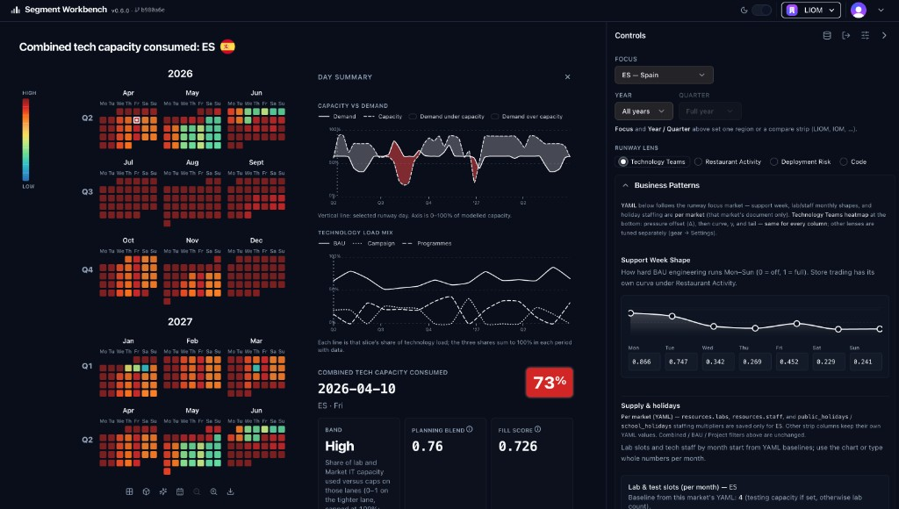
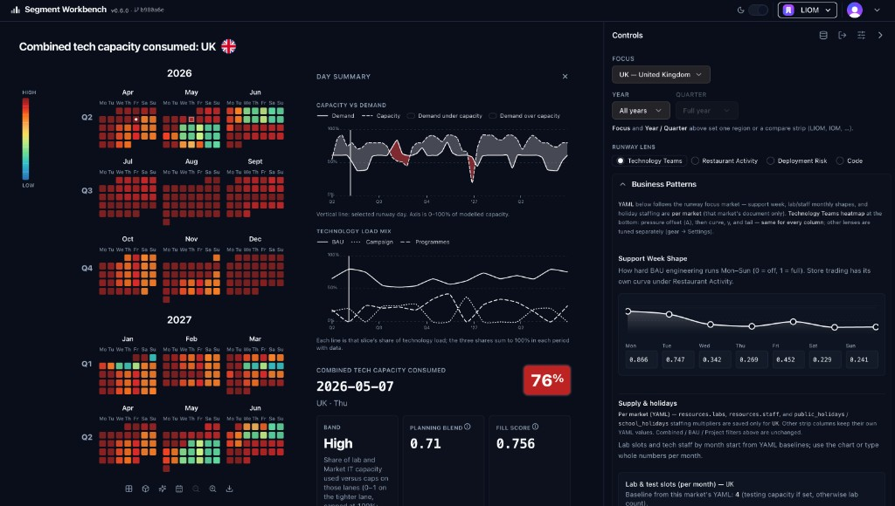

# Segment Workbench

**One calendar. Declared supply. Declared demand. A runway you can read in seconds.**

This app does not replace your planning tools. It **replaces the argument about what “busy” means** by making capacity **finite, dated, and visible** — then rolling it forward so crunch shows up **before** the week arrives.

<p align="center">
  
</p>

---

## The problem it solves

Organisations rarely lack *data*. They lack a **single, honest stack** of truth on the **same timeline**.

Projects live in one place. Promotions in another. Holidays and school breaks in a third. “How thin is tech?” lives in slide decks and hallway lore. Each slice optimises locally; **the cost is paid in meetings** — reconciling three versions of reality after the decision was already half-made.

**Segment Workbench** closes that gap with one idea: **put supply and demand in the same file, on the same days**, and let software **add the load, shrink the envelope where the calendar says so, and paint where it hurts.**

---

## The core move: capacity as physics, not opinion

Think in three layers. All three are **encoded** (today as **YAML per market**) so they stay **inspectable** and **comparable** across regions without forcing identical numbers.

| Layer              | Plain question                                               | Role in the model                                                                                                                                                                                 |
| ------------------ | ------------------------------------------------------------ | ------------------------------------------------------------------------------------------------------------------------------------------------------------------------------------------------- |
| **Supply**         | How much room exists, and **when does the calendar eat it?** | Named caps (people, labs, slots) plus multipliers for holidays, leave bands, and similar. This is your **denominator** — and it changes by day.                                                   |
| **Demand**         | What **pulls** on that envelope?                             | BAU, dated campaigns (prep + live), technology programmes, and other consumers. Each has **timing** and **how much** of the finite resources it asks for.                                         |
| **Risk & context** | If we ship here, **how exposed are we?**                     | Trading rhythm, promotion weight, deployment norms, named fragile windows. **Guidance**, not a second hidden spreadsheet — combined with utilisation so “hot” means something you can **unpack**. |

**Commercial moments are not binary.** A flagship promotion and a light promo can sit in the same schema; **intensity** (for example `promo_weight`) scales how hard they hit the **commercial** and **risk** surfaces without pretending every box on the calendar is the same size.

---

## Organisation view: actual capacity, market by market

This is not an org chart. It is a way to **surface what capacity actually is**: **effective supply on each day** (named caps after local working and calendar reality) and **declared demand** on the **same** days from BAU, trading rhythm, campaigns, technology programmes, and named business or deployment windows.

**Per market**, nuance lives in the **values and dates**—work patterns, collective leave and public holidays, trading shape, campaign prep and live intensity, programme windows—not in a pile of incompatible definitions of “busy.” Each country keeps its own envelope; the scenario file is where that honesty is encoded.

**Across markets**, the contract is **shared field meanings** in inspectable YAML (`public/data/markets/`), so segment and centre read comparable runways **without** pretending every market shares the same calendar. Side-by-side and multi-market views stay fair when **lens semantics** stay consistent; they should not replace local reality with a bland segment average.

For **quarterly-style planning**, this layer belongs **early**: it makes **absorption and crunch visible before** initiative lists and dependencies fully harden elsewhere—so “can the week carry this?” is argued from **one recomputable model** instead of reconciled slide decks after the fact.

---

## What the scenario file actually says

Below are **illustrative fragments**. They are simplified for reading; real markets live under `public/data/markets/` with the same **field meanings** everywhere. Full pipeline order and schema: [docs/MARKET_DSL_AND_PIPELINE.md](docs/MARKET_DSL_AND_PIPELINE.md).

### 1. Finite resources — the hard ceiling

```yaml
# What exists before programmes and campaigns argue over it.
resources:
  labs:
    capacity: 6
  staff:
    capacity: 4
    monthly_pattern_basis: absolute
    monthly_pattern:
      Jan: 4
      May: 3
      Aug: 2
  testing_capacity: 4
```

These numbers are **not** decoration. They are the **caps** the engine compares against once all the day’s asks are summed.

### 2. The calendar shrinks the envelope

Same market, thinner weeks: **effective** supply drops even when headcount on paper does not.

```yaml
national_leave_bands:
  - label: August collective leave (illustrative)
    from: '2026-08-01'
    to: '2026-08-31'
    capacity_multiplier: 0.72

public_holidays:
  auto: false
  dates:
    - '2026-05-01'
    - '2026-12-25'
  staffing_multiplier: 0.25
  trading_multiplier: 1.0
```

So **utilisation** is always **load ÷ that day’s effective supply** — not “busy” as a mood and not a single static FTE count.

### 3. Demand stacks on the same grid

**Baseline** (always drawing breath):

```yaml
bau:
  days_in_use: [mo, tu, we, th, fr, sa, su]
  weekly_cycle:
    labs_required: 1
    staff_required: 1
  market_it_weekly_load:
    weekday_intensity:
      Mon: 0.87
      Tue: 0.75
      Wed: 0.34
```

**Dated commercial work** — prep, then live — with an explicit **size** knob:

```yaml
campaigns:
  - name: Spring promotion
    start_date: '2026-04-10'
    duration: 30
    testing_prep_duration: 28
    promo_weight: 1.0
    campaign_support:
      labs_required: 1
      tech_staff: 1
    live_campaign_support:
      labs_required: 1
      tech_staff: 1
```

**Dated change programmes** — same **time shape**, but **technology load only** (no store uplift from this block):

```yaml
tech_programmes:
  - name: POS channel refresh
    start_date: '2026-01-07'
    duration: 60
    programme_support:
      labs_required: 1
      tech_staff: 1
    live_programme_support:
      labs_required: 1
      tech_staff: 1
```

When prep windows overlap live windows overlap August, you see **compound pressure** because the model **adds** contributions the way the real week does — not the way three separate decks do.

### 4. Trading rhythm and named risk — why “full” and “fragile” differ

**Commercial heat** (weekly and seasonal shape, plus how campaigns lift the floor):

```yaml
trading:
  weekly_pattern:
    Mon: 0.65
    Tue: 0.70
    Wed: 0.80
    Thu: 0.78
    Fri: 0.95
    Sat: 1.0
    Sun: 0.72
  monthly_pattern:
    Jan: 0.72
    Jul: 1.0
    Dec: 0.82
  campaign_store_boost_live: 0.28
```

**Explicit fragile periods** (earnings, freeze windows, major events — whatever you name):

```yaml
deployment_risk_events:
  - id: results_window_q1
    start: '2026-05-13'
    end: '2026-05-15'
    severity: 0.52
```

**Capacity pressure** answers: *are we using the envelope?*  
**Risk** answers: *if we slip here, what else is true about that moment?*  
The UI keeps those **honest** — different lenses, same underlying scenario.

---

## What you see: three lenses, one truth

The runway and heatmaps read the **same YAML** through different questions:

- **Commercial / store intensity** — How hard is the **trading and promotional** environment, given `trading` and campaigns?
- **Technology teams** — How much of the **declared** tech envelope is committed, including BAU, programmes, and campaign-driven lab and staff asks (and where modeled, **people versus parallel lab lanes** — headcount alone often lies)?
- **Deployment risk** — **Guidance** that blends **how full things are** with **context** (trade, events, norms) for cutover conversations.

**Compare several markets** and the **colour contract stays consistent per lens** — the same hue band means the same kind of pressure from column to column, so side-by-side views stay fair.

### Workbench at a glance

The live UI is a **three-column read**: **runway heatmap** (months as grids, one colour per day for the active lens), a **day-summary column** (capacity vs demand and technology load mix mini-charts with inline visual legends, plus the **selected-day** headline **%**, **Low / Medium / High** band, and separate **Planning blend** vs **Fill score** figures with glossary tooltips), and a **controls rail** (focus market, year/quarter, lens radios, YAML-backed support-week shape, supply notes). The calendar **highlights the selected day**; the vertical marker on the minis tracks that same day on the modelled timeline.

<p align="center">
  
</p>

Screenshots live under [`docs/images/`](docs/images/) and use **repo-relative** paths so they render inline on GitHub and in most Markdown previews.

---

## Why this is a step change

| Before                                  | After                                                                                                      |
| --------------------------------------- | ---------------------------------------------------------------------------------------------------------- |
| Busy = anecdotes and disconnected lists | Busy = **summed load** on **named caps** on **named days**                                                 |
| “Biggest” mistaken for “tightest”       | **Declared headroom** — volume of work and **room to absorb it** can diverge, on the page                  |
| Experts-only dashboards                 | A surface **built to be read in the room** — colour, runway, drill-down to **which inputs** moved the cell |
| Trade-offs argued from memory           | Trade-offs argued from a **single inspectable model** you can change and recompute                         |

It is still **judgment-led**. The model does not remove leadership; it **grounds** timing, pilots, and sequencing in **one shared picture** instead of three reconciled afterward.

**Not** your system of record for projects or finance. **Yes** the layer you want **before** you lock dates — the map everyone points at.

---

## Repository map

| Path                        | Role                                                             |
| --------------------------- | ---------------------------------------------------------------- |
| `src/`                      | React SPA — workbench UI, engine, heatmap, runway                |
| `src/pages/admin/`          | Admin UI — market overview, fragment editors, build controls     |
| `api/`                      | Vercel serverless functions — auth, CRUD, build, publish         |
| `api/_lib/`                  | Shared server utilities — env, Supabase client, scope resolver   |
| `api/_services/`             | Business logic — fragments, assembly, cache, validation, import  |
| `supabase/migrations/`      | Postgres schema and seed data (managed via Supabase CLI)         |
| `public/data/markets/`      | Original per-market YAML (reference / seeding source)            |
| `scripts/`                  | Tooling — API bundler, seeding, verification, RLS tests          |
| `docs/`                     | Architecture, security, backlog, and product documentation       |

---

## Architecture

The application is built on a **Postgres-driven config assembly** architecture:

```
Browser (React SPA)
  ├── Workbench (capacity engine, heatmaps, runway)
  ├── Admin UI (market config, fragment editors)
  └── Expert YAML editor (paste/preview/apply)
      │
      ▼
Vercel Serverless Functions (api/)
  ├── Auth: Clerk JWT → internal scope resolution
  ├── Fragment CRUD + revision tracking
  ├── Validation pipeline
  ├── Assembly pipeline (fragments → YAML)
  ├── Build/publish lifecycle
  └── Cache layer (Upstash Redis)
      │
      ▼
Supabase Postgres (source of truth)
  ├── Organizational hierarchy (operating models → segments → markets)
  ├── Config fragment tables (campaigns, resources, BAU, trading, etc.)
  ├── Revision history + audit log
  ├── Build + artifact records
  └── Row-level security policies
```

**Key principles:**
- **Postgres is the canonical source of truth** for all editable configuration
- **YAML is a generated artifact** — assembled deterministically from fragments, versioned, immutable once published
- **Upstash Redis** is a cache layer only — never the source of truth
- **Clerk** provides authentication; internal scope resolution enforces authorization
- **Dual-mode authoring** — structured UI forms and expert YAML paste both flow through the same validation and revision pipeline

See [`docs/TECHNICAL_ARCHITECTURE.md`](docs/TECHNICAL_ARCHITECTURE.md) for the full design and [`docs/SECURITY_MODEL.md`](docs/SECURITY_MODEL.md) for the security model.
