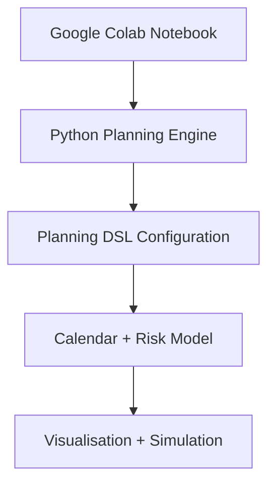
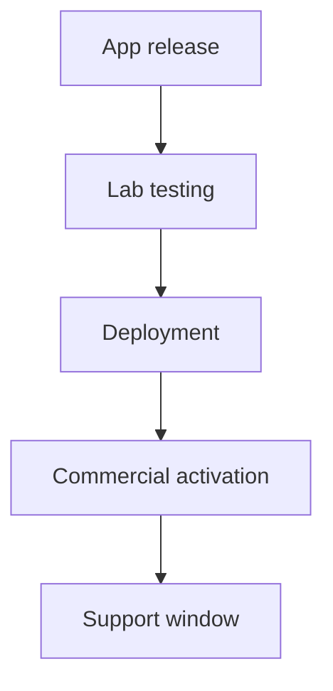

# Operational Weather Model

Multinational Capacity Surface Engine.

**Author:** Doug · **Role:** Segment Architecture

A product specification and architecture document for modelling operational capacity across markets and systems. The value is the planning methodology; visualisations support it. Use this brief with Cursor or any engineer to implement against.

---

## 1. Purpose

Multinational deployment planning often relies on fragmented inputs and informal judgement rather than a structured model of operational capacity.

Planning decisions must consider multiple interacting factors:

- commercial campaign calendars
- POS / App / Delivery release schedules
- backend platform capacity
- test lab availability
- team availability
- recurring BAU operational workload
- regional calendar signals (public holidays, trading peaks)

These inputs exist across different organisational groups and systems and are rarely analysed together.

The purpose of this tool is to model these inputs as a time-propagating operational capacity surface across markets and systems.

The model answers a single critical planning question:

**Where can change safely happen?**

---

## 2. Core Concept

This tool models multinational operations as pressure waves moving through time and systems.

### Phases (each initiative)

- Preparation
- Testing
- Deployment
- Commercial activation
- Stabilisation

### Domains (each phase consumes capacity)

- Labs
- Teams
- Backend services
- Operations
- Commercial environments

These workloads combine to produce a capacity risk surface over a rolling five-quarter horizon.

---

## 3. System Architecture



| Layer | Description |
| --- | ------------- |
| **Notebook** | User interface and orchestration layer. |
| **Planning Engine** | Python modules that perform modelling and analysis. |
| **DSL Configuration** | Compact configuration language used to describe markets and events. |
| **Calendar Model** | Generates a unified time series across markets. |
| **Visualisation** | Heatmaps, timelines and pilot-selection outputs. |

The reference implementation is the GitHub Pages web app (JavaScript + cal-heatmap); there is no Python codebase.

---

## 4. Key Design Principles

| Principle | Description |
| --- | ------------- |
| **Free** | The tool must remain free to use: no paid APIs, no proprietary dependencies that require a license. The stack (Python, plotly, Kaleido, Colab, etc.) is free and open source. |
| **Transparency** | All modelling assumptions must be visible in the notebook. |
| **Maintainability** | Markets must be defined using a DSL rather than large spreadsheets. |
| **Shareability** | The entire tool runs inside Google Colab for easy distribution. |
| **Analytical Depth** | The engine supports simulation and dependency modelling. |
| **Attribution** | The model explicitly identifies the creator of the methodology and engine. |

---

## 5. Python Engine

The planning engine will be implemented in Python.

**Estimated code size:** 800–1200 lines

**Modules (under `engine/`):**

| Module | Description |
| --- | ------------- |
| `dsl_parser.py` | Parse market DSL. |
| `calendar_engine.py` | Rolling calendar generation. |
| `phase_engine.py` | Phase and workload expansion. |
| `dependency_engine.py` | Cross-system dependency propagation. |
| `capacity_model.py` | Capacity aggregation. |
| `risk_model.py` | Risk scoring. |
| `market_selector.py` | Pilot candidate selection. |
| `visualisation.py` | Heatmaps and timelines. |
| `holiday_loader.py` | Environmental calendar signals. |
| `simulation.py` | Scenario simulation. |

---

## 6. DSL Market Configuration

The DSL is the secret sauce of the whole system. If the DSL is right, the tool will feel magical to use and painful to copy.

**Goal:** Describe an entire country's operational rhythm in ~10–15 lines.

Domain-specific languages are powerful because they express complex domain behaviour in compact, readable constructs tailored to the problem space. The engine converts the DSL into structured objects, then expands **market × systems × phases × days** into a dataframe—so a single DSL file can generate hundreds of calendar days of workload.

### Minimal Market DSL Template (~12 lines)

**Example country configuration:**

```dsl
market UK

capacity labs=5 teams=6 backend=1200

bau weekly_data
  every Tue
  support Tue-Wed
  load labs=2 teams=2 ops=1

campaign summer_menu
  start 2026-05-10
  duration 14d
  load commercial=3 backend=2

release app_v5
  systems App POS
  phases test:-21 deploy:0 support:+7
  load labs=2 backend=3 ops=1
```

That describes: recurring BAU cadence, campaigns, releases, system dependencies, and workload phases. From that tiny spec the engine expands ~450 calendar days of workload.

### Internal model (engine interpretation)

The Python engine converts the DSL into:

- **MarketConfig**
  - **Capacity** (labs, teams, backend)
  - **BAU events**
  - **Campaigns**
  - **Releases** (and optionally Infra, Dependencies)

### Block reference

| Block | Purpose | Engine expansion |
| --- | --- | --- |
| **BAU** | Baseline recurring load (e.g. data-package test cycle). | Every *day* (e.g. Tue): apply load; *support window* (e.g. Tue–Wed) for support load. |
| **Release** | System release with phased workload. | T-21 lab testing, T deployment, T+7 support window; produces the capacity wave. |
| **Campaign** | Time-bound commercial activity. | Apply load multipliers (commercial activity ↑, backend traffic ↑) across the duration. |
| **Infra** | Platform engineering (e.g. server patches). | `infra server_patch` with `start`, `duration`, `load backend=3 ops=1`. |
| **Holiday** | Not defined in DSL. | Engine auto-loads UK bank holidays, school holidays (via `holidays`), then applies modifiers (e.g. capacity labs × 0.7). |
| **Dependency** | System ordering for propagation. | `dependency` block: e.g. `backend → App`, `App → POS`; enables workload propagation. |

### Multi-lab support

If a market has multiple lab types:

```dsl
capacity labs_pos=2 labs_kiosk=1 labs_app=2
```

The engine can allocate workloads to specific lab types.

### Resulting data expansion

A single DSL file generates rows such as:

| date | market | system | phase | lab_load | backend_load |
| --- | --- | --- | --- | --- | --- |
| 2026-05-01 | UK | App | test | 2 | 1 |
| 2026-05-02 | UK | App | test | 2 | 1 |
| 2026-05-03 | UK | POS | test | 3 | 0 |

From that dataframe the tool generates heatmaps, timelines, and risk surfaces.

### Why this DSL is powerful

It expresses **operational behaviour** (cadence, dependencies, phases, capacity) rather than raw data rows. You capture intent; the engine fills the calendar. That makes it concise, readable, scalable across markets, and easy to extend—and avoids manually filling spreadsheets.

### New market onboarding: generate_market

The notebook can expose a command:

```python
generate_market("NL")
```

The engine auto-creates a **starter DSL** for the new market using:

- holidays (from `holidays` for that country)
- known BAU cadence templates
- template capacity values

So a new market can be onboarded in seconds. When you demo the tool, showing UK.dsl, DE.dsl, FR.dsl—each ~12 lines—then running the notebook to produce a 5-quarter operational surface, the contrast is extremely impressive.

---

## 7. Calendar Model

The engine generates a rolling five-quarter calendar with core dimensions:

- date
- market
- system
- phase

Workload attributes are attached:

- tech_activity
- ops_activity
- commercial_activity
- resourcing
- backend_load

Capacity metrics are then calculated.

---

## 8. Automatic Environmental Signals

The engine automatically imports calendar signals such as:

- public holidays
- school holidays
- seasonal retail peaks
- major retail events

**Python library used:** `holidays`

These signals modify workload assumptions.

---

## 9. Capacity Layers

The model evaluates capacity across several domains.

| Layer | Examples |
| --- | ---------- |
| **Operational capacity** | test labs, test teams |
| **Commercial activity** | campaign launches, promotion cycles |
| **Technology activity** | POS releases, mobile app releases, delivery platform changes |
| **Digital platform capacity** | AWS microservices, API load, backend release windows |

These layers combine to generate a unified risk score.

---

## 10. Risk Model

**Example scoring model:**

```text
risk_score =
  0.35 * lab_utilisation
+ 0.30 * team_utilisation
+ 0.20 * backend_pressure
+ 0.15 * commercial_pressure
```

**Outputs include:**

- risk_band
- capacity_pressure
- deployment_suitability

---

## 11. Phase Engine

Events propagate workload through phases.

**Flow:**



The phase engine expands events into workload waves using offsets.

**Example offsets:**

```text
phase test   offset -21d
phase deploy offset 0
phase stabilise offset +7d
```

---

## 12. Dependency Engine

Systems depend on each other.

**Example dependency chain:**

```text
backend → app → POS → commercial
```

The dependency engine propagates workload across systems.

---

## 13. Data Model

The primary dataframe generated by the engine has the following columns:

| Column | Description |
| --- | ------------- |
| date | Calendar date |
| market | Market identifier |
| system | System (e.g. POS, App) |
| phase | Phase name |
| tech_activity | Technology workload |
| ops_activity | Operations workload |
| commercial_activity | Commercial workload |
| resourcing | Resourcing load |
| backend_load | Backend load |
| lab_capacity | Lab capacity metric |
| team_capacity | Team capacity metric |
| risk_score | Aggregated risk score |

Data is aggregated weekly for visualisation.

---

## 14. Visualisation Layer

Visualisation uses Python libraries (primary: plotly; supporting: pandas, numpy, ipywidgets). The **primary visual asset** for leadership is a **GitHub contribution–style heatmap with multi-layer overlays**—one consistent, polished view that can show multiple dimensions on a single slide.

### Leadership presentations: purpose and design bar

The visuals are built to go into **leadership presentations**—PowerPoint, town halls, and similar contexts. They must look **beautiful** and purposeful: not slideware for the sake of slideware. The point is to **model how the things we do put pressure on market activities**; the charts are part of understanding that. Every visual should support the story: *here is where our releases, campaigns, and BAU load land; here is where risk builds; here is where change can safely happen.* Design for clarity and impact—clean typography, restrained colour, no chart junk—so the slide earns its place in the deck and helps leadership see the pressure surface at a glance.

### GitHub-style contribution heatmap

- **Layout:** A grid of cells: **rows** = markets (or segments), **columns** = time (weeks across the 5-quarter horizon). Each cell represents one week (or day) for one market.
- **Encoding:** Cell colour = intensity of the selected metric (e.g. empty/low → light, high → dark or saturated). Same visual language as GitHub’s contribution graph: compact, scannable, no chart junk.
- **Two-way link to data:** Each cell is linked back to the underlying data. **Hover over a cell** to see a tooltip listing the **activities** that contribute to that cell (e.g. which releases, campaigns, BAU events, phases) and the cell’s metric value. So the heatmap is not just a picture—it’s an interactive view: click or hover to see *what* that week and market are made of.
- **Use case:** At a glance, leadership sees where activity or risk is concentrated across markets and time; on hover, they see exactly which activities drive each cell. One chart fits on a single slide.

### Multi-layer overlays

The **same grid geometry** is reused for different **layers** (metrics). The viewer switches the layer; the layout stays identical so the brain keeps context.

| Layer | Meaning | Typical use |
| --- | --- | --- |
| **Tech** | Technology workload (releases, lab, backend) | Where tech pressure sits |
| **Ops** | Operations workload (support, BAU, deploy) | Where ops capacity is consumed |
| **Commercial** | Commercial activity (campaigns, traffic) | Where commercial peaks are |
| **Risk** | Aggregated risk score | Where it’s safe or fragile to deploy |
| **Lab utilisation** | Lab capacity consumed | Lab bottlenecks |
| **Team utilisation** | Team capacity consumed | Team bottlenecks |
| **Backend pressure** | Backend load | Platform stress |

- **Interaction:** Notebook/UI provides a **layer selector** (dropdown or tabs): same heatmap, same axes, only the colour scale and underlying metric change. Optional: small multiples (e.g. tech / ops / commercial / risk in a 2×2 grid) for a single slide with all four dimensions.
- **Result:** One visual model—GitHub-style grid + multi-layer overlays—makes the tool look seriously polished on a single slide for leadership.

---

## 15. Notebook UI Structure

1. Concept: Operational Weather Model
2. Load market configurations
3. Generate calendar
4. Compute risk surface
5. Segment heatmap
6. Market deep dive
7. Pilot candidate selector
8. Scenario simulation

---

## 16. Segment Heatmap (GitHub-style + layers)

Displays **stacked heatmaps across markets** using the visual model in §14: GitHub contribution–style grid with multi-layer overlays.

- **Grid:** One row per market (e.g. UK, DE, FR); columns = weeks (or days) across the 5-quarter horizon. Each cell = one time bucket, colour = intensity for the **selected layer**.
- **Layer selector:** User picks which metric drives the colour: tech activity, ops activity, commercial activity, resourcing, backend pressure, or **total risk**. Same grid, same axes; only the colour mapping changes. Optional: small multiples (e.g. tech / ops / commercial / risk in one view) for a single slide.
- **Hover tooltips (two-way link):** Hovering over a cell shows **which activities** that cell represents: e.g. “UK · Week 2026-05-04 · Risk 0.42 — App test, POS deploy, summer_menu campaign, weekly_data BAU”. So every cell is traceable back to the underlying releases, campaigns, and BAU that produced it.
- **Example layout (one layer):**

```text
     W1  W2  W3  W4  W5  W6  …  (weeks)
UK   ░░  ▒▒  ▓▓  ▒▒  ░░  ░░
DE   ░░  ░░  ▒▒  ▓▓  ▓▓  ▒▒
FR   ▒▒  ▒▒  ░░  ▒▒  ▒▒  ▓▓
```

(░ light → ▓ dark = low to high intensity for that layer.)

This asset—one consistent, readable heatmap with switchable layers—is what makes the tool look seriously polished on a single slide for leadership. When exported to PowerPoint or shown in town halls, it should look **beautiful and purposeful**: the goal is understanding how what we do puts pressure on market activities, not decoration.

---

## 17. Market Deep Dive

Detailed view for one market:

- capacity heatmap
- event timeline
- BAU rhythm
- system dependencies

---

## 18. Pilot Candidate Selector

Evaluates markets for initiative pilots.

**Inputs:**

- pilot duration
- earliest start date
- required systems
- risk threshold

**Output:**

| Market | Suitability | Best Window |
| ------ | ----------- | ----------- |
| CZ     | High        | May W2–W6   |
| UK     | Medium      | Jun W3–W4   |
| FR     | Low         | None        |

---

## 19. Scenario Simulation

The system allows experimentation.

**Example simulations:**

- Move campaign +2 weeks
- Add pilot activity
- Increase lab capacity
- Delay app release

The risk surface updates automatically.

---

## 20. Attribution and Provenance

The model includes explicit authorship.

**Visualisation annotation:**

```text
Operational Weather Model
Concept & Implementation: Doug
```

**Runtime signature:**

```text
Operational Weather Model
Author: Doug
Generated: <timestamp>
```

**Engine metadata:**

```python
__model_name__ = "Operational Weather Model"
__model_author__ = "Doug"
```

This ensures the model remains attributable.

---

## 21. Data and config (outside the bundle)

**Data must remain untouched** when you release new versions of the tool. User data and config should **not** live inside the installable package or the notebook file.

- **DSL and config:** Keep market DSL files (and any user config) in a **separate directory** that the notebook **reads from**, e.g. `./data/` or `~/operational-weather-data/` with `markets/UK.dsl`, etc. The package contains only the **engine** and, optionally, **example** DSLs as read-only defaults. The notebook sets a **data path** (e.g. `DATA_DIR = "./data"` or an env var) and loads from there. When you ship a new bundle, that folder is never replaced, so data remains untouched.
- **Outputs:** Exported CSVs, saved charts, and scenario results should be written to a path **outside** the package (e.g. `./outputs/` or `DATA_DIR/outputs/`), so updates never overwrite user outputs.
- **Optional:** Config or market definitions can live in a **Google Sheet** or Excel; the notebook reads from the sheet. The sheet is then the external source of truth and is untouched by code updates.

---

## 22. Releases and versioning

You can periodically release new versions by shipping a **Python bundle** and dropping it into the notebook environment.

- **Pip-installable package:** Make the project installable (e.g. `pyproject.toml` or `setup.py`). Build a **wheel** (e.g. `python -m build` → `dist/operational_weather_model-0.2.0-py3-none-any.whl`). In Colab or Jupyter, one cell at the top runs e.g. `%pip install -q /path/to/operational_weather_model-0.2.0-py3-none-any.whl` (or `pip install git+https://...@v0.2.0`). Updating = ship a new wheel and change the version in that install cell.
- **Version in the package:** Set `__version__ = "0.2.0"` in the package (e.g. in `engine/__init__.py` or `pyproject.toml`) and bump it per release. Keep `__model_name__` and `__model_author__` for attribution.
- **Alternative:** Zip the `engine/` (and optionally `config/`) and add it to `sys.path` in the notebook; replace the zip to update. Versioning is optional unless you add `__version__` inside the package.

---

## 23. Export to presentation

Charts are built with **Plotly** for use in **leadership presentations**—PowerPoint, town halls, and similar. They should export as **beautiful, purposeful** slides that support the story (how what we do puts pressure on market activities), not generic slideware.

- **Static images (for slides):** Use `fig.write_image("heatmap.png")` or `fig.write_image("heatmap.svg")`. Requires **Kaleido** (`pip install kaleido`). PNG or SVG can be pasted into PowerPoint or Google Slides.
- **PDF:** `fig.write_image("heatmap.pdf")` (same Kaleido backend) for one-chart-per-page or reports.
- **Automated deck (optional):** Use **python-pptx** to build a `.pptx`: create slides and place Plotly-generated images (PNG/SVG) on each slide. The notebook can export figures then call python-pptx to assemble the deck. All dependencies (Plotly, Kaleido, python-pptx) are free and open source.

---

## 24. Strategic Outcome

The tool transforms planning from **opinion-driven decisions** to **capacity-driven planning**.

It enables leadership to identify:

- safe pilot markets
- fragile operational windows
- capacity imbalances
- system stress points

---

## 25. Long-Term Potential

The prototype can evolve into:

- an enterprise planning tool
- a deployment simulation platform
- a capacity forecasting system

The Colab implementation allows rapid demonstration without infrastructure approval.

---

If you’d like, I can also give you the exact Cursor prompt that will generate the entire Python engine skeleton for this brief in one shot, which will save you hours when you start building.
