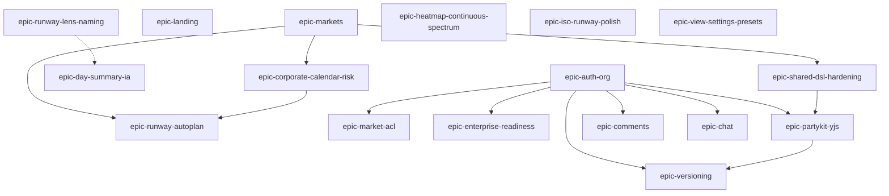

# Product backlog — epics

Structured for prioritization and for breaking into **engineering plans** (human or agent). Each epic has a stable **`epic id`** (use in issues and scripts), **goal**, **scope hints**, **dependencies**, and **outcomes**.

**Runway auto-plan** is an **in-app feature** (initiative slots), not the same as the **roadmap phases** below.

---

## Epic index (single list)

Epics appear in **suggested dependency order**. Items in the same phase can often run in parallel.

| Phase | Epic id | Epic |
|-------|---------|------|
| **1 — Foundation** | `epic-markets` | [Data model — segments, countries, and markets](#epic-markets--data-model--segments-countries-and-markets) |
| | `epic-landing` | [Landing page & first-run story](#epic-landing--landing-page--first-run-story) |
| | `epic-shared-dsl-hardening` | [Shared workspace hardening (Blob path)](#epic-shared-dsl-hardening--shared-workspace-hardening-current-blob-path) |
| **1b — Runway experience** | `epic-runway-lens-naming` | [Runway lens naming & surface consistency](#epic-runway-lens-naming--runway-lens-naming--surface-consistency) |
| | `epic-heatmap-continuous-spectrum` | [Heatmap — continuous spectrum](#epic-heatmap-continuous-spectrum--heatmap--continuous-spectrum-interpolated-ramp) |
| | `epic-day-summary-ia` | [Day summary & cell detail — IA](#epic-day-summary-ia--day-summary--cell-detail--information-architecture) |
| | `epic-iso-runway-polish` | [Isometric runway (3D) — polish](#epic-iso-runway-polish--isometric-runway-3d--visual-polish--label-stability) |
| | `epic-view-settings-presets` | [View settings vs scenario — presets](#epic-view-settings-presets--view-settings-vs-scenario-data--clarity--presets) |
| **2 — Planning intelligence** | `epic-runway-autoplan` | [Runway auto-plan (initiative slot finder)](#epic-runway-autoplan--runway-auto-plan-initiative-slot-finder) |
| | `epic-corporate-calendar-risk` | [Corporate calendar & deployment risk](#epic-corporate-calendar-risk--corporate-calendar--deployment-risk-windows) |
| **3 — Identity & access** | `epic-auth-org` | [User, org, and permissions (foundation)](#epic-auth-org--user-org-and-permissions-foundation) |
| | `epic-market-acl` | [Market & segment authoring permissions](#epic-market-acl--market--segment-authoring-permissions) |
| **4 — Collab core** | `epic-partykit-yjs` | [Real-time collaborative editing (Yjs + PartyKit)](#epic-partykit-yjs--real-time-collaborative-editing-yjs--partykit) |
| **5 — History** | `epic-versioning` | [Workspace version control & history](#epic-versioning--workspace-version-control--history) |
| **6 — Comms** | `epic-comments` | [Comments (contextual annotations)](#epic-comments--comments-contextual-annotations) |
| | `epic-chat` | [In-app chat](#epic-chat--in-app-chat) |
| **7 — Enterprise quality** | `epic-enterprise-readiness` | [Enterprise readiness — quality, access, trust](#epic-enterprise-readiness--enterprise-readiness--quality-access-and-trust-cross-cutting) |

**Handoffs:** [HANDOFF_EPIC_MARKETS.md](./HANDOFF_EPIC_MARKETS.md) (`epic-markets`). [HANDOFF_EPIC_LANDING.md](./HANDOFF_EPIC_LANDING.md) (`epic-landing`). [HANDOFF_EPIC_USER_ORG_ENTERPRISE.md](./HANDOFF_EPIC_USER_ORG_ENTERPRISE.md) (`epic-auth-org`). Runway UX (naming + day-summary): [HANDOFF_PHASE_1B_RUNWAY_UX.md](./HANDOFF_PHASE_1B_RUNWAY_UX.md). Remaining runway UX notes (mostly addressed; see **Phase 1b snapshot** below): [HANDOFF_RUNWAY_UX_REMAINING.md](./HANDOFF_RUNWAY_UX_REMAINING.md).

**Shelved (backlog):** **`epic-dsl-llm-assistant`** — OpenAI YAML coding assistant under Code view (former header Toybox toggle + `?llm` URL). **Header entry points removed** (Apr 2026) until a rebuild. Residual code: `useAtcStore.dslLlmAssistantEnabled`, `DslAssistantPanel`, `MainDslWorkspace` (`?llm` query can still open the dock for local dev).

### Phase 1b — progress snapshot (Apr 2026)

These epics are **largely shipped** in prod; treat scope bullets as **stretch / follow-ups** unless marked remaining in the epic body.

| Epic id | Status |
|---------|--------|
| `epic-runway-lens-naming` | **Shipped** — `VIEW_MODES`, glossary, docs; `lensCopy.ts` for heatmap blend captions tied to the same source. |
| `epic-heatmap-continuous-spectrum` | **Shipped** — smooth ramp + Settings toggle + legend gradient / ticks; mono and export semantics unchanged. |
| `epic-day-summary-ia` | **Mostly shipped** — progressive disclosure + lead metric; repetitive tooltip copy reduced (shared footnote, shorter readiness line). Optional: compact surface **table** still backlog. |
| `epic-iso-runway-polish` | **Mostly shipped** — themed empty/pad tokens, label halo, compare-all **market-strip seams**, SVG `geometricPrecision`, light-mode label tweak. Optional: HTML chronology band if breakpoints still misbehave. |
| `epic-view-settings-presets` | **Shipped** — scenario vs device copy in Workspace; JSON export/import; **named on-device presets**; README / PRODUCT_BASELINE. Blob `ui_state` defaults still future. |

**All epic ids (copy-paste):** `epic-markets`, `epic-landing`, `epic-shared-dsl-hardening`, `epic-runway-lens-naming`, `epic-heatmap-continuous-spectrum`, `epic-day-summary-ia`, `epic-iso-runway-polish`, `epic-view-settings-presets`, `epic-runway-autoplan`, `epic-corporate-calendar-risk`, `epic-auth-org`, `epic-market-acl`, `epic-partykit-yjs`, `epic-versioning`, `epic-comments`, `epic-chat`, `epic-enterprise-readiness`, `epic-dsl-llm-assistant` (shelved).

---

## Epic details

---

### epic-markets — Data model — segments, countries, and markets

**Goal:** Let the product add **new runway segments** and **new countries/markets** without deep code changes each time.

**Repo status:** Market inventory is **manifest-driven** (`scripts/generate-market-manifest.mjs`, `public/data/markets/*.yaml`, generated manifest consumed by the app). Formal “add a country” checklist and segment semantics remain in [HANDOFF_EPIC_MARKETS.md](./HANDOFF_EPIC_MARKETS.md).

**Scope (indicative):**

- Manifest-driven or config-driven market list (extend `generate-market-manifest`, `public/data/markets/*`, runway ordering).
- Clear contract: what a “segment” means in DSL + UI (filters, columns, rules).
- Validation and seeds for new ISO / region entries.
- Docs or internal checklist for “add a country” (YAML + assets + manifest).

**Dependencies:** None (foundational).

**Outcomes:** Checklist or script path to ship a new market; fewer hard-coded assumptions in UI and DSL parsing.

**Tags:** `data`, `markets`, `segments`

**Handoff (design + implementation):** [HANDOFF_EPIC_MARKETS.md](./HANDOFF_EPIC_MARKETS.md)

---

### epic-landing — Landing page & first-run story

**Goal:** A proper **marketing / entry** experience before the heavy app shell (or alongside it).

**Repo status:** **Shipped baseline** — `BrowserRouter`: **`/`** = `LandingPage`, **`/app`** = workbench (`main.tsx`). Product story, mocks, and BOM-style sourcing on the landing page; workbench **header title links back to `/`**. SEO / OG polish can still deepen.

**Scope (indicative):**

- Route structure: `/` landing vs `/app` (or similar) if the tool stays SPA-heavy.
- Value prop, screenshots or demo, link to docs / GitHub if public.
- Optional: auth entry points placeholder (Sign in) for future user model.
- SEO basics (title, meta, OG) if public.

**Dependencies:** Optional alignment with **User & org** (`epic-auth-org`) if login CTA is real.

**Outcomes:** New visitors understand the product; clear path into the workspace.

**Tags:** `marketing`, `ux`, `routing`

**Handoff (design + implementation):** [HANDOFF_EPIC_LANDING.md](./HANDOFF_EPIC_LANDING.md)

---

### epic-shared-dsl-hardening — Shared workspace hardening (current Blob path)

**Goal:** Keep **non-collab** Blob save/load trustworthy until Postgres + PartyKit (or version API) own the story.

**Repo status:** **PUT** returns **`version`** (duplicate of Blob `etag`); **409** surfaces a **dismissible app banner** plus Workspace copy; **PRODUCT_BASELINE** updated for limits and Clerk/Blob behaviour.

**Scope (remaining / indicative):**

- Optional migration to **integer version** in DB; richer conflict UX — see **Version control** (`epic-versioning`).
- No realtime multi-tab presence; users **Pull from cloud** when needed.

**Dependencies:** Overlaps **Collaborative editing** (`epic-partykit-yjs`) and **Version control** (`epic-versioning`).

**Outcomes:** Predictable saves, honest 409 handling, documented limits.

**Tags:** `shared-dsl`, `blob`, `reliability`

---

### epic-runway-lens-naming — Runway lens naming & surface consistency

**Goal:** **Control labels, runway headings, and tooltips** use the same vocabulary so execs and planners aren’t reconciling “Technology Teams” vs “tech headroom” or inconsistent deployment-risk naming.

**Repo status:** **Shipped** — `VIEW_MODES` + `runwayHeatmapTitleForViewMode` in `constants.ts`; glossary and PRODUCT_BASELINE aligned; legacy ids via `normalizeViewModeId`. **`src/lib/lensCopy.ts`** keeps tooltip blend row captions derived from the same lens titles (reduces drift).

**Scope (indicative):**

- Align `VIEW_MODES` labels with `runwayHeatmapTitle` and glossary copy (`src/lib/constants.ts`, `runwayDayDetailsGlossary`, README / PRODUCT_BASELINE).
- Short lens names + one-line subtitles where radio space is tight (e.g. Technology capacity / headroom; Deployment & calendar risk).
- Sweep header, legend, and day-detail strings for the old names; keep legacy `normalizeViewModeId` mappings for persisted keys.

**Dependencies:** None.

**Outcomes:** One clear name per lens everywhere in the UI; docs match shipped strings.

**Tags:** `ux`, `copy`, `runway`

---

### epic-heatmap-continuous-spectrum — Heatmap — continuous spectrum (interpolated ramp)

**Goal:** **Differentiate heavy-load days** beyond ten solid bands by interpolating colour along the existing anchor palette (same ten stops, smooth RGB lerp between neighbours).

**Repo status:** **Shipped** — `heatmapColorContinuous` path, persisted **`heatmapSpectrumContinuous`**, Settings (Palette) toggle, **HeatmapLegend** gradient + reference ticks; discrete bands remain available; **mono** behaviour preserved.

**Scope (indicative):**

- Use `heatmapColorContinuous` (already in `riskHeatmapColors.ts`) for spectrum cell fills instead of/in addition to `heatmapColorDiscrete`; optional **Settings** toggle: banded vs smooth (default TBD).
- Update **legend** (`HeatmapLegend`, swatch helpers): gradient strip or ticked ramp so it matches cells; adjust `heatmapLegendSwatchAtBand` / call sites if legend stays discrete for reference only.
- Keep **mono** mode behaviour; ensure tooltips / export still describe “temperature” scale honestly.
- Optional later: perceptual lerp (OKLab) if RGB mid-tones feel muddy.

**Dependencies:** None.

**Outcomes:** Finer visual distinction in the red/orange head of the scale; legend truthful to mapping.

**Tags:** `heatmap`, `visual`, `runway`

---

### epic-day-summary-ia — Day summary & cell detail — information architecture

**Goal:** Clicking a cell yields a **scannable** story: what the **tile colour means** for the active lens first; long KPI / blend copy is **secondary**, not one wall of text.

**Repo status:** **Mostly shipped** — `RunwayDayDetailsBody` + glossary separate heatmap paint vs planning blend; progressive disclosure. **Apr 2026:** `runwayTooltipBreakdown` — shorter **pressure surface** lines + **one shared footnote** (`pressureSurfaceFootnote`); tighter **readiness / sustain** sentence. **Remaining (optional):** compact **Surface | scheduled | free** table instead of bullets.

**Scope (indicative):**

- **Lead block:** one sentence + headline metric (`fillMetricHeadline`, `fillMetricValue`, risk band) per lens; progressive disclosure (“How this is calculated” collapsed or tab).
- **Shorten repetitive strings** in `runwayTooltipBreakdown.ts` (e.g. `pressureSurfaceLines`, `techReadinessSustainExplanation`) — one shared footnote for “tighter lane; backend excluded” instead of repeating per bullet.
- **Surface breakdown:** small table or compact rows (`Surface | scheduled | free`) vs four near-duplicate sentences.
- **Separate** “this heatmap’s paint” from **planning blend / combined risk** so users aren’t confused in one scroll (`RunwayDayDetailsBody`, `RunwayCellTooltip` / side panel).
- Popover = minimal; side panel = optional depth (existing `presentation` split).

**Dependencies:** None; aligns with **Lens naming** (`epic-runway-lens-naming`) for terminology.

**Outcomes:** Faster comprehension; less copy fatigue; easier onboarding.

**Tags:** `ux`, `tooltips`, `runway`, `copy`

---

### epic-iso-runway-polish — Isometric runway (3D) — visual polish & label stability

**Goal:** **Iso skyline / city block** feels as intentional in **light mode** as in dark mode; **month / quarter / year** labels don’t subtly drift with responsive SVG scaling.

**Repo status:** **Mostly shipped** — CSS variables for **empty / pad** faces and **label stroke** (`index.css`, `RunwayIsoHeatCell`); ground chronology seams use theme `currentColor`. **Apr 2026:** **compare-all** faint **market-strip seams** on the ground plane (`RunwayIsoCityBlock`); root SVG **`shape-rendering: geometricPrecision`** (skyline + city block); slightly stronger **light-mode** label halo. **Remaining (optional):** HTML overlay or viewBox tweaks if label drift is still reported at specific breakpoints.

**Scope (indicative):**

- **Theme-aware empty / pad styling:** replace fixed `EMPTY_*` RGB in `RunwayIsoHeatCell` with tokens or CSS variables so light backgrounds don’t look like dark-mode leftovers; tune pad cells and strokes for contrast.
- **Label drift:** review `RunwayIsoSkyline` (`preserveAspectRatio`, expanded viewBox, `moMatrix` text); consider **HTML overlay** axis for month/quarter/year or pixel-snapping / separate SVG band.
- **Compare-all** path: same treatment in `RunwayIsoCityBlock`.
- Optional: subtle column outline in light mode for separation.

**Dependencies:** None.

**Outcomes:** Cohesive light/dark iso views; readable chronology axis at common breakpoints.

**Tags:** `visual`, `runway`, `3d`, `a11y-contrast`

---

### epic-view-settings-presets — View settings vs scenario data — clarity & presets

**Goal:** Users understand **what travels with the team** (YAML / Blob workspace) vs **what is personal** (browser persistence in `useAtcStore`), and can share **heatmap / filter preferences** without forking markets.

**Repo status:** **Shipped** — In-app copy: **Team workspace** vs **View on this device** (`SharedWorkspaceSection`, `LocalDataSection`); **export / import JSON** (`viewSettingsPreset.ts`) with **`VIEW_SETTINGS_PAYLOAD_KEYS`** aligned to Zustand `partialize`; **named on-device presets** (`viewSettingsNamedPresets.ts`, save/apply/delete in Workspace). **README** + **PRODUCT_BASELINE** document scenario vs browser state. **Not shipped:** team-default **`ui_state`** in Blob / YAML sidecar (still later if product wants it).

**Scope (indicative):**

- **In-app copy:** short explainer near Workspace / Controls (market YAML vs “my view settings on this device”).
- **Export / import JSON** for UI-only state: curves, γ, tail power, filters, 3D toggle, heatmap style — separate from YAML export (optional names e.g. “CFO view”).
- **Later:** optional team-default `ui_state` in Blob or YAML sidecar — only if product wants shared defaults without polluting canonical DSL.
- Document in PRODUCT_BASELINE / README when shipped.

**Dependencies:** None; complements **Shared workspace hardening** (`epic-shared-dsl-hardening`) and **User & org** (`epic-auth-org`) for server-side presets later.

**Outcomes:** Less “why does my heatmap look different?” confusion; shareable view presets.

**Tags:** `ux`, `settings`, `workspace`, `dx`

---

### epic-runway-autoplan — Runway auto-plan (initiative slot finder)

**Goal:** The user gives the system a **project / initiative type** (and rough shape—duration, prep, constraints). The system uses **runway heatmap analysis, pressure, and resourcing** to propose **where to drop it on the calendar**—not just “find a gap,” but a **suggested slot** that respects how tight tech and business load already are.

**Scope (indicative):**

- **Project taxonomy:** Structured input (type, duration, prep, optional flags)—UI form or natural language that normalizes to that structure.
- **Per-market tech / capability config:** Each market carries **YAML (or sidecar) describing the tech stack / lanes** the reasoner must respect (what “counts” as competing load, what stacks can run which initiative classes). Intended to be **LLM-legible** so an assistant can apply policy consistently; deterministic rules can ship first.
- **Analysis inputs:** Existing engine outputs—daily risk, lab/team/backend loads, campaign prep/live windows, holidays, trading pressure—fed as **structured context** (not a screenshot) into scoring +/or LLM.
- **Output:** **Suggested slot** (date range, market(s), confidence or rationale bullets); optional “alternates” ranked second/third.
- **Explicit non-goal for v1:** Pure “first empty week” without pressure awareness—that’s a different, weaker feature.
- **Later input:** **Corporate calendar & deployment risk** (`epic-corporate-calendar-risk`)—Q4 fragility, earnings, shareholder and franchisee events—as hard or soft constraints on slot scoring.

**Dependencies:** **Data model / markets** (`epic-markets`); runway pipeline outputs already available in-app. **User & org** optional for saving favourite project templates; not required for a read-only suggester POC.

**Outcomes:** PM or planner can request “slot for initiative X” and get a defensible calendar recommendation grounded in current YAML + stack config.

**Tags:** `autoplan`, `slot-finder`, `runway`, `heatmap`, `llm`, `planning`

---

### epic-corporate-calendar-risk — Corporate calendar & deployment risk windows

**Goal:** Make **business-calendar risk** first-class in planning—not only tech load and store trading, but **when markets are unwilling or extra-vulnerable to big change** because of how the year closes and how external events can derail communications.

**Product narrative (why it matters):**

- **Q4 / year-end:** Trading year closing and figures being finalised raise the cost of mishaps; early in the year, gaps can sometimes be **recovered through more aggressive promotional activity**, but **late Q4** stacks **holiday period**, **higher baseline trade**, and **no runway to recover** if something goes wrong (e.g. tech or ops issues)—a “perfect storm” for deployment risk.
- **Corporate / market events:** Locals may avoid large deployments ahead of **earnings calls**, **shareholder meetings**, or **franchisee co-op meetings**, where **external events** can derail the narrative regardless of delivery quality—risk is as much **reputational and coordination** as utilisation.

**Scope (indicative):**

- **Capture in model:** Optional DSL or sidecar (per market or segment)—e.g. named **blackout windows**, **elevated-risk bands** (Q4 default curve), or **event types** with dates (earnings, AGM, co-op) that feed **scoring** or **auto-plan** constraints rather than changing tech capacity math directly.
- **UI:** Surface these windows on the runway (overlay, legend, tooltip lines) and/or feed **Runway auto-plan** so suggested slots **avoid** or **penalise** them explicitly.
- **Separation of concerns:** Keep **Technology Teams** heatmap as **scheduled work vs capacity**; corporate risk is an **additional lane** or **planning multiplier** on combined risk / slot finder—aligned with the existing split between tech KPIs and store-trading rhythm.

**Dependencies:** **Data model / markets** (`epic-markets`); **Runway auto-plan** is the natural consumer once windows exist as structured data. Can ship **documentation + YAML convention** before full engine support.

**Outcomes:** Planners can encode “no-go” or “high-caution” periods with a defensible story; slot finder and combined risk can reflect **calendar fragility**, not only utilisation.

**Tags:** `risk`, `calendar`, `q4`, `planning`, `dsl`, `runway`

---

### epic-auth-org — User, org, and permissions (foundation)

**Goal:** **Identity and tenancy** so shared workspaces, billing, and audit are sane later.

**Repo status:** **Advanced POC** — **Clerk** sign-in (`SignInGate`, `VITE_AUTH_DISABLED` bypass); **GET/HEAD/PUT** verify session JWT when `CLERK_SECRET_KEY` is set; optional legacy write secret; **org write allow list** (`CAPACITY_CLERK_DSL_WRITE_ROLES` / `VITE_*`); **viewer vs editor** via `cap_*` session claims + org admin roles; **UserButton** / **OrganizationSwitcher** in shell. **Remaining:** per-org Blob paths, formal SSO/SCIM ops guides, optional `CAPACITY_AUTH_MODE`-style migration flag if you need an explicit legacy toggle beyond env presence. See [AUTH_PROVIDER.md](./AUTH_PROVIDER.md).

**Scope (indicative):**

- Provider choice (e.g. Clerk, Auth0) vs minimal custom JWT.
- Org/team entity, membership, role (viewer / editor / admin).
- Map “team workspace” to `workspace_id` / org; retire or wrap shared secret as bootstrap only.

**Dependencies:** None for MVP auth shell; **blocks** secure PartyKit, comments attribution, version history “who,” and **market ACL** enforcement on the server.

**Outcomes:** `userId`, `orgId` available in client and API; protected routes pattern.

**Tags:** `auth`, `foundation`, `multi-tenant`

**Handoff (implementation):** [HANDOFF_EPIC_USER_ORG_ENTERPRISE.md](./HANDOFF_EPIC_USER_ORG_ENTERPRISE.md)

---

### epic-market-acl — Market & segment authoring permissions

**Goal:** **Enforceable** limits on which markets a user may **view, focus, and edit** in workspace YAML—e.g. **one market only**, **all markets in a segment** (e.g. IOM vs LIOM), or **full access** for admins—so restricted users cannot bypass the UI via the API.

**Repo status:** **Mostly shipped** — Server **GET** returns YAML **filtered** to allowed markets; **PUT** **merges** partial multi-doc YAML for scoped editors (`api/shared-dsl.ts`). Client **`useCapacityAccess`**, runway manifest order filtering, DSL mutation lock for viewers. Session claim **`cap_mkts`** (comma market ids) **narrows** **`cap_segs`** or stands alone. **Remaining:** Clerk ops doc for assigning metadata; **automated** role × market × PUT matrix tests; optional stricter “single market only” product rule on top of claims.

**Scope (indicative):**

- **Claims / metadata model** — session claims `cap_admin`, `cap_segs`, `cap_ed`, **`cap_mkts`** (see [AUTH_PROVIDER.md](./AUTH_PROVIDER.md)); extend if product needs richer rules.
- **Clerk (or provider)** — document how ops assign segment vs per-market access (user/org metadata + session token template).
- **Client** — Monaco / runway / header: hide, disable, or read-only for disallowed markets; align with `filterManifestOrderForAccess` / `runwayFocusAllowed`.
- **Server** — **`/api/shared-dsl`** filters GET YAML and merges scoped PUT bodies (implemented); **org-scoped blob paths** when combined with `epic-auth-org` multi-tenancy.
- **Tests / matrix** — roles × markets × PUT accept/reject (automated coverage still backlog).

**Dependencies:** **`epic-auth-org`** for verified JWT; **org-scoped storage paths** remain backlog. Server-side market ACL for shared-dsl **ships** with claim parsing in `api/shared-dsl.ts`.

**Outcomes:** Documented role matrix; no saving disallowed markets through the API; procurement-credible “who can edit what.”

**Tags:** `auth`, `acl`, `markets`, `enterprise`

---

### epic-partykit-yjs — Real-time collaborative editing (Yjs + PartyKit)

**Goal:** **Multiple editors** in the same workspace without last-write-wins over HTTP Blob alone.

**Repo status:** **MVP shipped in tree** — PartyKit server `party/collab.ts` (per-market rooms, Clerk JWT + `cap_*` ACL), client `src/lib/collab/*` + `DslEditorCore` `y-monaco` when `VITE_COLLAB_ENABLED=1` and `VITE_PARTYKIT_HOST` set. Deploy PartyKit (`pnpm party:deploy`), set `CLERK_SECRET_KEY` on the PartyKit project. Spec: [docs/superpowers/specs/2026-04-06-partykit-yjs-collaborative-dsl-design.md](./superpowers/specs/2026-04-06-partykit-yjs-collaborative-dsl-design.md).

**Scope (indicative):**

- PartyKit project, `y-partykit` server, deploy + env (`VITE_PARTYKIT_HOST`, room id strategy).
- Client: `Y.Doc`, provider lifecycle, feature flag.
- `y-monaco` (or chosen binding) for workspace YAML; single `Y.Text` MVP then optional split by market.
- Hydration from current load path (Blob/local); define single writer to Zustand for collab buffer.

**Dependencies:** **User & org** (`epic-auth-org`) (or interim shared secret) for **connection auth** on PartyKit; optional coexistence with Blob checkpoint.

**Outcomes:** Two browsers see live edits; reconnect behavior documented.

**Tags:** `collab`, `partykit`, `yjs`, `monaco`

---

### epic-versioning — Workspace version control & history

**Goal:** **Named or timed snapshots**, diff, restore — distinct from CRDT sync (complementary).

**Scope (indicative):**

- Storage: Postgres (or Blob versioned keys) + `version`, `created_at`, `created_by`, optional label.
- API: list versions, get version, restore (with confirm).
- UI: timeline or list, diff view (Monaco diff or textual).
- Policy: auto-save snapshot debounce vs manual “Save version.”

**Dependencies:** **User & org** (`epic-auth-org`) for attribution; **Collaborative editing** (`epic-partykit-yjs`) defines whether snapshots capture Yjs export or merged YAML from server.

**Outcomes:** Users can roll back and audit “what changed when.”

**Tags:** `versioning`, `history`, `postgres`, `ux`

---

### epic-comments — Comments (contextual annotations)

**Goal:** **Threaded comments** tied to DSL lines, markets, or UI regions — not the same as chat.

**Scope (indicative):**

- Anchor model: line range in YAML, or `marketId` + optional line, or component id.
- CRUD API + store; resolve/delete/moderation for org admins.
- Optional: realtime “someone commented” via same stack as chat.

**Dependencies:** **User & org** (`epic-auth-org`); stable identifiers in DSL or file path.

**Outcomes:** Review and async feedback on plans without editing the YAML.

**Tags:** `comments`, `collaboration`, `review`

---

### epic-chat — In-app chat

**Goal:** **Team communication** inside or beside the workspace (contextual to org/workspace).

**Scope (indicative):**

- Product choice: embed (e.g. provider) vs custom (channels, messages table, realtime).
- Realtime transport (PartyKit channel, Ably, Supabase Realtime, etc.).
- Persistence, search, notifications (stretch).

**Dependencies:** **User & org** (`epic-auth-org`) strongly; rooms keyed by `workspace_id` or `org_id`.

**Outcomes:** Members can message without leaving the app.

**Tags:** `chat`, `realtime`, `social`

---

### epic-enterprise-readiness — Enterprise readiness — quality, access, and trust (cross-cutting)

**Goal:** Raise the bar toward **enterprise-standard** delivery without replacing epics above: accessibility, observability, procurement-facing basics, and identity extensions.

**Scope (indicative):**

- **Accessibility:** tabular or textual **alternate** for heatmap summaries; keyboard path for cell selection already partial — extend where gaps remain.
- **Observability:** client error reporting / RUM for heavy runway views; serverless route health for `api/*`.
- **Identity extensions (after `epic-auth-org`):** SSO / SAML where provider supports it; SCIM stretch.
- **Trust:** export bundle includes **engine / schema version** narrative for reproducibility; security FAQ pointers (Blob read path until auth, etc.).
- **Data lifecycle hooks:** retention / delete story documented for when Postgres + orgs exist (may overlap **Version control**).

**Dependencies:** **User & org** (`epic-auth-org`) for SSO and tenant delete; some items can start earlier (a11y, client errors).

**Outcomes:** Clearer compliance story; fewer silent failures in production.

**Tags:** `enterprise`, `a11y`, `observability`, `security`

---

## Roadmap notes & dependency graph

The **Epic index** table above is the canonical ordered list. Phases are a default sequence when scheduling; parallel work is fine inside a phase when dependencies allow.

### Dependency graph (mermaid)

---

## How to turn epics into sprint plans

1. Pick an **`epic id`** from the index (e.g. `epic-runway-autoplan`).
2. Expand into **stories** (vertical slices): e.g. “schema for per-market stack config in YAML,” “slot scorer from `RiskRow[]`,” “LLM prompt + structured output for suggestion.”
3. For each story, list **files likely touched** (search codebase) and **acceptance criteria** (testable).
4. Run implementation in **one epic at a time** unless dependencies are satisfied.

When you’re ready, name an epic id and ask for a **sprint-sized plan** — we can turn it into an ordered task list against this repo.
