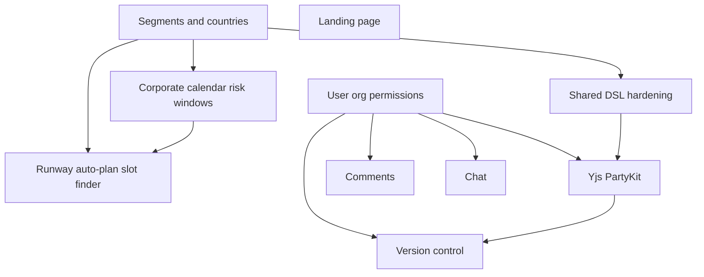

# Product backlog — epics

Structured for prioritization and for breaking into **engineering plans** (human or agent). Each epic lists **goal**, **scope hints**, **dependencies**, and **suggested outcomes**.

**Naming:** **Runway auto-plan** (epic below) is an **in-app feature**—suggested initiative slots from runway analysis. **Roadmap** at the bottom is **build order** for these epics, not that feature.

---

## Epic: Data model — segments, countries, and markets

**Goal:** Let the product add **new runway segments** and **new countries/markets** without deep code changes each time.

**Scope (indicative):**

- Manifest-driven or config-driven market list (extend `generate-market-manifest`, `public/data/markets/*`, runway ordering).
- Clear contract: what a “segment” means in DSL + UI (filters, columns, rules).
- Validation and seeds for new ISO / region entries.
- Docs or internal checklist for “add a country” (YAML + assets + manifest).

**Dependencies:** None (foundational).

**Outcomes:** Checklist or script path to ship a new market; fewer hard-coded assumptions in UI and DSL parsing.

**Tags:** `data`, `markets`, `segments`

---

## Epic: Landing page & first-run story

**Goal:** A proper **marketing / entry** experience before the heavy app shell (or alongside it).

**Scope (indicative):**

- Route structure: `/` landing vs `/app` (or similar) if the tool stays SPA-heavy.
- Value prop, screenshots or demo, link to docs / GitHub if public.
- Optional: auth entry points placeholder (Sign in) for future user model.
- SEO basics (title, meta, OG) if public.

**Dependencies:** Optional alignment with **User & org model** if login CTA is real.

**Outcomes:** New visitors understand the product; clear path into the workspace.

**Tags:** `marketing`, `ux`, `routing`

---

## Epic: User, org, and permissions (foundation)

**Goal:** **Identity and tenancy** so shared workspaces, billing, and audit are sane later.

**Scope (indicative):**

- Provider choice (e.g. Clerk, Auth0) vs minimal custom JWT.
- Org/team entity, membership, role (viewer / editor / admin).
- Map “team workspace” to `workspace_id` / org; retire or wrap shared secret as bootstrap only.

**Dependencies:** None for MVP auth shell; **blocks** secure PartyKit, comments attribution, version history “who.”

**Outcomes:** `userId`, `orgId` available in client and API; protected routes pattern.

**Tags:** `auth`, `foundation`, `multi-tenant`

---

## Epic: Real-time collaborative editing (Yjs + PartyKit)

**Goal:** **Multiple editors** in the same workspace without last-write-wins over HTTP Blob alone.

**Scope (indicative):**

- PartyKit project, `y-partykit` server, deploy + env (`VITE_PARTYKIT_HOST`, room id strategy).
- Client: `Y.Doc`, provider lifecycle, feature flag.
- `y-monaco` (or chosen binding) for workspace YAML; single `Y.Text` MVP then optional split by market.
- Hydration from current load path (Blob/local); define single writer to Zustand for collab buffer.

**Dependencies:** **User & org** (or interim shared secret) for **connection auth** on PartyKit; optional coexistence with Blob checkpoint.

**Outcomes:** Two browsers see live edits; reconnect behavior documented.

**Tags:** `collab`, `partykit`, `yjs`, `monaco`

---

## Epic: Workspace version control & history

**Goal:** **Named or timed snapshots**, diff, restore — distinct from CRDT sync (complementary).

**Scope (indicative):**

- Storage: Postgres (or Blob versioned keys) + `version`, `created_at`, `created_by`, optional label.
- API: list versions, get version, restore (with confirm).
- UI: timeline or list, diff view (Monaco diff or textual).
- Policy: auto-save snapshot debounce vs manual “Save version.”

**Dependencies:** **User & org** for attribution; **Collaborative editing** defines whether snapshots capture Yjs export or merged YAML from server.

**Outcomes:** Users can roll back and audit “what changed when.”

**Tags:** `versioning`, `history`, `postgres`, `ux`

---

## Epic: Runway auto-plan (initiative slot finder)

**Goal:** The user gives the system a **project / initiative type** (and rough shape—duration, prep, constraints). The system uses **runway heatmap analysis, pressure, and resourcing** to propose **where to drop it on the calendar**—not just “find a gap,” but a **suggested slot** that respects how tight tech and business load already are.

**Scope (indicative):**

- **Project taxonomy:** Structured input (type, duration, prep, optional flags)—UI form or natural language that normalizes to that structure.
- **Per-market tech / capability config:** Each market carries **YAML (or sidecar) describing the tech stack / lanes** the reasoner must respect (what “counts” as competing load, what stacks can run which initiative classes). Intended to be **LLM-legible** so an assistant can apply policy consistently; deterministic rules can ship first.
- **Analysis inputs:** Existing engine outputs—daily risk, lab/team/backend loads, campaign prep/live windows, holidays, trading pressure—fed as **structured context** (not a screenshot) into scoring +/or LLM.
- **Output:** **Suggested slot** (date range, market(s), confidence or rationale bullets); optional “alternates” ranked second/third.
- **Explicit non-goal for v1:** Pure “first empty week” without pressure awareness—that’s a different, weaker feature.
- **Later input:** **Corporate calendar & deployment risk** (`epic-corporate-calendar-risk`)—Q4 fragility, earnings, shareholder and franchisee events—as hard or soft constraints on slot scoring.

**Dependencies:** **Data model / markets** (stable ids, manifest); runway pipeline outputs already available in-app. **User & org** optional for saving favourite project templates; not required for a read-only suggester POC.

**Outcomes:** PM or planner can request “slot for initiative X” and get a defensible calendar recommendation grounded in current YAML + stack config.

**Tags:** `autoplan`, `slot-finder`, `runway`, `heatmap`, `llm`, `planning`

**Epic id:** `epic-runway-autoplan`

---

## Epic: Corporate calendar & deployment risk windows

**Goal:** Make **business-calendar risk** first-class in planning—not only tech load and store trading, but **when markets are unwilling or extra-vulnerable to big change** because of how the year closes and how external events can derail communications.

**Product narrative (why it matters):**

- **Q4 / year-end:** Trading year closing and figures being finalised raise the cost of mishaps; early in the year, gaps can sometimes be **recovered through more aggressive promotional activity**, but **late Q4** stacks **holiday period**, **higher baseline trade**, and **no runway to recover** if something goes wrong (e.g. tech or ops issues)—a “perfect storm” for deployment risk.
- **Corporate / market events:** Locals may avoid large deployments ahead of **earnings calls**, **shareholder meetings**, or **franchisee co-op meetings**, where **external events** can derail the narrative regardless of delivery quality—risk is as much **reputational and coordination** as utilisation.

**Scope (indicative):**

- **Capture in model:** Optional DSL or sidecar (per market or segment)—e.g. named **blackout windows**, **elevated-risk bands** (Q4 default curve), or **event types** with dates (earnings, AGM, co-op) that feed **scoring** or **auto-plan** constraints rather than changing tech capacity math directly.
- **UI:** Surface these windows on the runway (overlay, legend, tooltip lines) and/or feed **Runway auto-plan** so suggested slots **avoid** or **penalise** them explicitly.
- **Separation of concerns:** Keep **Technology Teams** heatmap as **scheduled work vs capacity**; corporate risk is an **additional lane** or **planning multiplier** on combined risk / slot finder—aligned with the existing split between tech KPIs and store-trading rhythm.

**Dependencies:** **Data model / markets**; **Runway auto-plan** is the natural consumer once windows exist as structured data. Can ship **documentation + YAML convention** before full engine support.

**Outcomes:** Planners can encode “no-go” or “high-caution” periods with a defensible story; slot finder and combined risk can reflect **calendar fragility**, not only utilisation.

**Tags:** `risk`, `calendar`, `q4`, `planning`, `dsl`, `runway`

**Epic id:** `epic-corporate-calendar-risk`

---

## Epic: In-app chat

**Goal:** **Team communication** inside or beside the workspace (contextual to org/workspace).

**Scope (indicative):**

- Product choice: embed (e.g. provider) vs custom (channels, messages table, realtime).
- Realtime transport (PartyKit channel, Ably, Supabase Realtime, etc.).
- Persistence, search, notifications (stretch).

**Dependencies:** **User & org** strongly; rooms keyed by `workspace_id` or `org_id`.

**Outcomes:** Members can message without leaving the app.

**Tags:** `chat`, `realtime`, `social`

---

## Epic: Comments (contextual annotations)

**Goal:** **Threaded comments** tied to DSL lines, markets, or UI regions — not the same as chat.

**Scope (indicative):**

- Anchor model: line range in YAML, or `marketId` + optional line, or component id.
- CRUD API + store; resolve/delete/moderation for org admins.
- Optional: realtime “someone commented” via same stack as chat.

**Dependencies:** **User & org**; stable identifiers in DSL or file path.

**Outcomes:** Review and async feedback on plans without editing the YAML.

**Tags:** `comments`, `collaboration`, `review`

---

## Epic: Shared workspace hardening (current Blob path)

**Goal:** Keep **non-collab** Blob save/load trustworthy until Postgres + PartyKit (or version API) own the story.

**Scope (indicative):**

- POC currently has **no** multi-tab stale toast; users **Pull from cloud** when needed. Revisit **server `version` + optional banner** when auth lands.
- Optional migration to **integer version** in DB; clearer conflict UX in-app.

**Dependencies:** Overlaps **Collaborative editing** and **Version control**.

**Outcomes:** Predictable saves, honest 409 handling, documented limits.

**Tags:** `shared-dsl`, `blob`, `reliability`

---

## Roadmap: suggested implementation phase order

Use this as a default **dependency-aware sequence** when scheduling engineering work. Epics in the same phase can sometimes run in parallel if staffed.

| Phase | Epics | Notes |
|-------|--------|--------|
| **1 — Foundation** | Data model (segments/countries), Landing page (lite), Shared workspace polish (optional) | Baseline in [PRODUCT_BASELINE.md](./PRODUCT_BASELINE.md). |
| **2 — Planning intelligence** | **Runway auto-plan** (slot finder); **Corporate calendar & deployment risk** (optional, feeds constraints / scoring) | Auto-plan uses runway + stack config; corporate windows extend DSL/scoring when ready—see `epic-corporate-calendar-risk`. |
| **3 — Identity** | User, org, and permissions | Unblocks everything that needs “who.” |
| **4 — Collab core** | Yjs + PartyKit | After auth story for rooms; can use secret-gated MVP before full JWT. |
| **5 — History** | Workspace version control | Needs stable YAML export + user ids. |
| **6 — Comms** | Comments, then Chat (or Comments first if review is higher priority) | Both need identity; comments often smaller than full chat. |

### Dependency graph (mermaid)

### Machine-friendly epic ids

Use in issues or plan scripts: `epic-markets`, `epic-landing`, `epic-runway-autoplan`, `epic-corporate-calendar-risk`, `epic-auth-org`, `epic-partykit-yjs`, `epic-versioning`, `epic-comments`, `epic-chat`, `epic-shared-dsl-hardening`.

---

## How to turn epics into sprint plans

1. Pick a **phase** or **epic id** (e.g. `epic-runway-autoplan`).
2. Expand into **stories** (vertical slices): e.g. “schema for per-market stack config in YAML,” “slot scorer from `RiskRow[]`,” “LLM prompt + structured output for suggestion.”
3. For each story, list **files likely touched** (search codebase) and **acceptance criteria** (testable).
4. Run implementation in **one epic at a time** unless dependencies are satisfied.

When you’re ready, name an epic id and ask for a **sprint-sized plan** — we can turn it into an ordered task list against this repo.
