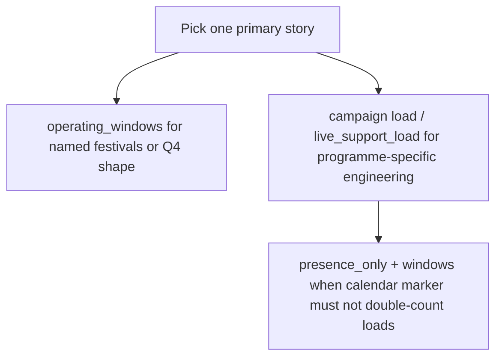

# Campaigns, trading rhythm, and early-month store boost

## Campaigns (`campaigns[]`)

Each campaign is a dated interval. The engine uses it for **readiness loads** (phase engine), **campaign risk / presence** flags, and optional **store-pressure boosts** during prep and live (`tradingPressure` knobs).

### Per-market campaign intensity (`trading.campaign_effect_scale`)

Some countries run **more aggressive in-store campaigns** than others. Set **`campaign_effect_scale`** under **`trading`** (default **1**, clamped **0–2.5** in the parser) to scale in one place:

- **`campaign_risk`** fed into the **Business** lens blend (Marketing channel) and the combined **`risk_score`** blend, and  
- effective **`campaign_store_boost_prep`** / **`campaign_store_boost_live`** (Restaurant uplift during prep/live).

Use **`0`** only if you want campaigns to affect **readiness loads** but **not** the trading/heatmap campaign channels. Fine-tune individual boosts in YAML as needed; **`campaign_effect_scale`** is the national temperament dial.

### YAML × UI scenario overlay

Each market’s **`campaign_effect_scale`** (YAML) is multiplied in the pipeline by the **Campaign scenario overlay** slider in the Risk / pressure panel (**`campaignEffectUiMultiplier`** in app state). **Effective** scale per market = `min(2.5, max(0, YAML × slider))`. The slider is **not** written back to YAML — reset it to **1×** when comparing markets on DSL alone.

**Risk blend weights** (Tech / Restaurant / Marketing / Resources) are **UI-only**; they are not DSL keys.

---

## Authoring cookbook: how “hot” should campaigns feel?

| Question | Prefer |
| --- | --- |
| Calendar presence for a programme but load already in a window? | **`presence_only: true`** on the campaign + loads in **`operating_windows`**. |
| Distinct build vs live engineering curves? | **Lead model:** `prep_before_live_days`, `load`, `live_support_load` (see table below). |
| First N days of the window = build, rest = hypercare? | **`readiness_duration`** + `live_support_load` (lead model usually clearer for authors). |
| Heavier national “campaign culture” in stores? | Raise **`trading.campaign_effect_scale`** (~1.15–1.35); tune **`campaign_store_boost_*`** for prep vs live uplift. |

**`impact`** vs **`load.commercial`:** If **`load.commercial`** is set, it wins for the default commercial intensity; otherwise **`impact`** maps to a 0.25–1.0 commercial default and **`campaign_risk`**.

| Knob | Role |
| --- | --- |
| **`live_support_load`** | Explicit buckets for the **live** segment (omitted keys = 0 in that segment). |
| **`live_support_scale`** | When `live_support_load` is empty and lead model applies: scales **`load`** for live (default ~0.45 in engine). |
| **`live_tech_load_scale`** | Multiplier on **labs / Market IT / backend only** during live so engineering can taper while ops/commercial stay hot. |

| YAML / field | Role |
| --- | --- |
| `name` | Identifier; shown in tooltips and risk metadata. |
| `start` | Go-live date (`YYYY-MM-DD`). |
| `duration` | Live segment length in **days** (`durationDays` in code). |
| `prep_before_live_days` | **Prep window** ends the day before `start`. Prep runs from `start − prep_before_live_days` (inclusive of that first day) through the day before go-live. During prep, **`load`** drives engineering / ops / commercial readiness (unless staggered; see below). |
| `load` | Per-surface **multipliers** during prep (and during live if you do not set a separate live profile). Keys: `labs`, `teams`, `backend`, `ops`, `commercial`. |
| `live_support_load` | Loads for the **live** segment `[start, start + duration)`. If omitted and `prep_before_live_days` is set, live engineering surfaces can fall back to `load × live_support_scale` (default scale in parser ~0.45). |
| `live_support_scale` | Only when `live_support_load` is empty: scales `load` for the live segment. |
| `live_tech_load_scale` | Optional multiplier on **labs / Market IT / backend only** during live (not ops/commercial), so in-flight retail can be lighter than prep. |
| `impact` | If `commercial` is omitted in `load`, **commercial** can be inferred from impact (`low` / `medium` / `high` / `very_high`). |
| `stagger_functional_loads` | When `true` with `prep_before_live_days`, prep is **split by function**: tech (labs / Market IT / backend) in a late window before live, commercial and ops in windows ending at go-live (see `CampaignConfig` in `src/engine/types.ts` for defaults like `tech_finish_before_live_days`). |
| `presence_only` | Calendar / risk marker only: does **not** add phase loads (avoids double-counting with `operating_windows`). |

**Simplifying:** If you only need a single flat prep + live story, use `prep_before_live_days`, `load`, and `live_support_load`. Add `stagger_functional_loads` only when you need different prep horizons for tech vs marketing vs supply.

### `replaces_bau_tech` (optional boolean)

When **`true`**, on any **prep** or **live** day where this campaign contributes **labs, Market IT, or backend** (YAML `load.teams`; including stagger slices that include tech in prep, and the resolved sustain load in live — same rules as phase expansion):

- The market’s recurring **`tech.weekly_pattern`** row is **not** added for that day.
- The market’s recurring **`tech.support_weekly_pattern`** / **`support_pattern`** teams row is **not** added for that day (same `stripBauTechBuckets` gate as weekly tech rhythm).
- **BAU** rows still run, but **labs / Market IT / backend** are forced to **0** (ops/commercial from BAU unchanged).

So programmes that **run through the same BAU delivery channel** can **replace** the weekly tech baseline for the whole in-flight window instead of stacking. If the **live** segment has no tech buckets (e.g. only ops/commercial hypercare), BAU tech is **not** stripped on those days. Default **`false`** preserves additive behaviour. Aliases: **`replacesBauTech`**, **`replace_bau_tech`**.

---

## Store trading (`trading`)

### `weekly_pattern`

After YAML parse, the DSL parser expands this the **same way as `tech.weekly_pattern`** (`expandTechWeeklyPattern` in `src/engine/techWeeklyPattern.ts`):

- Per day (`Sun` … `Sat`): a **number in [0, 1]** or a named level: `low` (0.25), `medium` (0.5), `high` (0.75), `very_high` (1).
- Compact form: `default`, `weekdays`, `weekend`, then optional per-day overrides.

`getStorePressureForDate` in `src/engine/pipeline.ts` reads the numeric value for that weekday. Further multipliers (monthly pattern, seasonal wave, early-month boost, holidays, campaigns) stack on top in the pipeline.

### `monthly_pattern`

Per-calendar-month scalar (Jan–Dec) multiplying the weekly base for that month.

### `seasonal`

Gentle annual wave (`peak_month`, `amplitude`) on store pressure.

### Early-month store boost (`payday_month_peak_multiplier`)

`storePaydayMonthMultiplier` in `src/engine/paydayMonthShape.ts` applies when `payday_month_peak_multiplier` (YAML `trading.payday_month_peak_multiplier` or tuning default) is **> 1**:

- Calendar **week 1** (days **1–7**): full **peak** multiplier on YAML-derived store pressure.
- **Days 8–21**: linear fade from peak down to **1×** (boost mostly gone by **week 3**).
- **Day 22 onward**: **1×** (no boost).

Uses **day-of-month** bands, not ISO week numbers. The YAML key name is legacy; behaviour is “early-month lift that dies away by week 3,” not pay-cycle alignment.

The pipeline applies this multiplier **after** the weekly/monthly/seasonal rhythm is already normalised to **0–1**, so the boost can push **`store_trading_base` / `store_pressure` above 1** (hard-capped at **`STORE_PRESSURE_MAX`** / 2.5 after campaign terms in `riskModelTuning.ts`). Combined **`risk_score`** still clamps to **1**.

**UI:** **Heatmap adjustments** → **Trading Patterns** is shown only in the **Restaurant Activity** lens. It edits **`trading.monthly_pattern`** and early-month store-boost knots (tuning + optional YAML) for the focused market.

---

## Tech rhythm (`tech`)

`weekly_pattern` uses the **same numeric / named / compact** rules as trading. `labs_scale`, `teams_scale`, `backend_scale` scale the daily 0–1 base into readiness loads in `src/engine/phaseEngine.ts`.

### Support patterns (`support_weekly_pattern`, `support_monthly_pattern`)

Optional **Market IT–only** baseline readiness (e.g. hypercare / standing support rhythm), **additive** to the main `weekly_pattern` row:

- **`support_weekly_pattern`** — Expanded with **`expandTechWeeklyPattern`** (same rules as `tech.weekly_pattern` / `trading.weekly_pattern`): per weekday **0–1**, or `default` / `weekdays` / `weekend`, or named levels (`low` … `very_high`). Missing days in a sparse map are not expanded unless the compact form fills them.
- **`support_monthly_pattern`** — Optional **Jan–Dec** scalars (**0–1**), same key names as **`trading.monthly_pattern`**. Per calendar day, the effective support load uses **weekly × monthly** for that month. **Omitted months behave as 1** (no change vs weekly shape) in the in-app patcher / `fullTradingMonthlyPatternFromPartial`-style defaults.
- **`support_teams_scale`** — Optional non-negative scalar (default **1**); scales the combined **Market IT** load after weekly × monthly.

The phase engine adds one extra row: **`TechRhythm` / `support_pattern`** with `{ labs: 0, teams: (support_teams_scale ?? 1) × weekly × monthly, backend: 0 }` (the **`teams`** field is Market IT capacity in the model), classification **readiness** / **bau** (same channel as the main weekly tech rhythm). The **Technology** heatmap and runway tooling pick this up through the normal phase expansion path.

**UI:** Under **Heatmap adjustments**, the **Support Patterns** tab is shown only in the **Technology Teams** lens. It includes **Daily Business Weightings** (**`tech.weekly_pattern`**, Mon–Sun) and support workload (**`tech.support_weekly_pattern`**, **`tech.support_monthly_pattern`**) with matching sparklines for the focused market. All of these edits live under **`tech:`** only — they do **not** change **`trading`** or the Restaurant Activity heatmap. **Technology load** on the runway is **Combined**, **BAU only**, or **Project work** (no separate Market-IT-only slice).

**Aliases (parser):** `supportWeeklyPattern`, `supportMonthlyPattern`, `supportTeamsScale`.

A `tech:` document may contain **only** support weekly (no main `weekly_pattern`) if you want purely additive support rhythm; the parser still emits `techRhythm` in that case (`mapTechRhythm` in `yamlDslParser.ts`).
