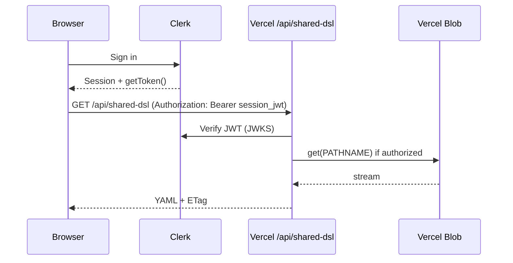

# Handoff: User, org & permissions — enterprise-grade foundation

**Epic:** User, org, and permissions (see [BACKLOG_EPICS.md](./BACKLOG_EPICS.md))  
**Epic id:** `epic-auth-org`  
**Stack context:** React 18 + Vite 6 SPA, deployed on **Vercel**, workspace YAML via **`api/shared-dsl.ts`** + **Vercel Blob** (`@vercel/blob`).

**Implementation status (repo):** **Phase 1 (client gate)** — `ClerkProvider` + `SignInGate` in `src/main.tsx`. **`ClerkSharedDslBridge`** registers `useAuth().getToken()` for `/api/shared-dsl` (same pattern as Clerk MCP `use-auth` snippet). **`VITE_AUTH_DISABLED=1`** bypasses the gate. **Phase 2 (API)** — when **`CLERK_SECRET_KEY`** is set on Vercel, GET/HEAD require a valid session JWT; PUT accepts JWT or legacy `CAPACITY_SHARED_DSL_SECRET` (`api/lib/clerkAuthSharedDsl.ts`, `verifyToken` from `@clerk/backend`). Optional **`CAPACITY_CLERK_AUTHORIZED_PARTIES`** (comma-separated origins). **Agent rule:** use the **user-clerk** MCP (`list_clerk_sdk_snippets`, `clerk_sdk_snippet`) when changing auth — see `.cursor/rules/clerk-auth-mcp.mdc`.

This document is a **build-ready handoff**: it assumes the reader will implement identity, protect the API, and wrap the existing shell—without rewriting the runway engine or DSL pipeline.

---

## 1. Why this epic is next (for “enterprise grade”)

| If you ship first… | You get… |
|--------------------|----------|
| **Phase 1b runway polish** (lens naming, continuous heatmap, tooltips, 3D) | Better UX; **no** tenancy, **no** protected YAML, **no** audit “who.” |
| **`epic-auth-org` (this epic)** | **Login gate**, **verified identity on the server**, path to **viewer vs editor**, and a credible story for **SOC2 / procurement** (“data not world-readable”). |

**Recommendation:** Treat **`epic-auth-org` as the next enterprise-critical epic.** Run Phase 1b in parallel only if you have a second builder; otherwise do auth first, then polish.

**Blocks unlocked:** PartyKit room auth, version history attribution, comments, secure Blob reads, Deployment Protection alignment, SSO later.

---

## 2. Current behaviour (inventory)

### 2.1 App shell

- **Entry:** `index.html` → `src/main.tsx` → **`src/App.tsx`** (single full-screen workbench: header, runway, `DSLPanel`).
- **No router:** everything is one route. Adding auth means either wrapping content after `SignedIn` or introducing **`react-router`** (optional; see §6).

### 2.2 Workspace YAML sources

1. **Bundled markets:** `public/data/markets/*.yaml` + `fetchRunwayMarketOrder()` (`src/lib/runwayManifest.ts`).
2. **Local persistence:** Zustand `persist` + `setAtcDsl` / storage helpers (`src/store/useAtcStore.ts`, `src/lib/storage.ts`).
3. **Team cloud (optional):** when **`VITE_SHARED_DSL`** is `1` at build time:
   - **GET `/api/shared-dsl`** — loads workspace from Blob **with no authentication** (anyone with the deployment URL can read YAML if a blob exists).
   - **PUT `/api/shared-dsl`** — requires **`Authorization: Bearer <CAPACITY_SHARED_DSL_SECRET>`** matching server env; browser stores pasted secret in **`sessionStorage`** under `capacity:shared-dsl-bearer` (`src/lib/sharedDslSync.ts`).

### 2.3 Critical files

| Area | Files |
|------|--------|
| Bootstrap (cloud vs bundle) | `src/App.tsx` (effect ~L126–186): `fetchSharedDsl()` → `hydrateFromStorage` → `initSharedDslOutboundSync()` |
| Cloud sync client | `src/lib/sharedDslSync.ts` — `fetchSharedDsl`, `putSharedDsl`, `getSharedDslBearer`, debounced auto-save |
| Cloud sync API | `api/shared-dsl.ts` — HEAD/GET/PUT, Blob path `capacity-shared/workspace.yaml` |
| Workspace UI | `src/components/SharedWorkspaceSection.tsx`, `src/components/DSLPanel.tsx` |
| Env types | `src/vite-env.d.ts` |

### 2.4 Security gaps (honest POC state)

- **GET is public** — enterprise blocker for sensitive planning YAML.
- **Shared write secret** — not per-user; no revocation per person; rotation = tell everyone a new secret.
- **No `userId` / `orgId`** in client or API for future audit.

---

## 3. Goals and non-goals (v1 of this epic)

### Goals

1. **Sign-in required** to use the app in production (configurable: allow anonymous for demo deploys if needed).
2. **`userId`** (and ideally **`orgId`**) available in React and verifiable on **Vercel serverless** routes.
3. **`/api/shared-dsl` GET (and HEAD)** require the same class of credential as PUT — i.e. **authenticated session** (or service token), not world-readable.
4. **Role hook:** at least **viewer vs editor** (even if v1 only hides save UI for viewers; server must enforce on PUT).
5. **Docs:** README + PRODUCT_BASELINE updated for env vars and “how login works.”

### Non-goals (defer)

- **Yjs / PartyKit** (separate epic; needs this auth first).
- **Postgres version history** (separate epic).
- **Full SCIM / SAML** — can be Phase 2 of auth via provider (Clerk/Auth0 org SSO).
- **Multi-workspace / multi-blob paths** — v1 can stay **one blob per deployment** or **one blob per org** once org exists.

---

## 4. Provider choice (decision)

**Default recommendation: [Clerk](https://clerk.com)** for this stack.

| Criterion | Why Clerk fits |
|-----------|----------------|
| Vite SPA | `@clerk/clerk-react` wraps the tree; no Next.js required. |
| Vercel Functions | Verify **session tokens** or **JWT** with official patterns / `verifyToken` (see Clerk docs for current API). |
| Orgs & roles | Organizations + roles map cleanly to **viewer / editor / admin**. |
| SSO later | Enterprise plans add SAML for same integration. |

**Alternative:** **Auth0** or **Descope** — same shape: SPA SDK + JWT verification in `api/shared-dsl.ts`. Pick one and avoid abstraction layers until a second provider is real.

**Deliverable:** Record the choice in this repo (e.g. `docs/AUTH_PROVIDER.md` one-pager) once decided.

---

## 5. Target architecture

**Rules:**

- **Never** send the old **`CAPACITY_SHARED_DSL_SECRET`** to the browser once session auth works for writes.
- **PUT** accepts **only** verified session (or optional **machine token** for CI) with **editor** role.
- **GET/HEAD** require **authenticated user** with at least **viewer** in the org that “owns” this deployment (v1: single org = all signed-in users in the Clerk app).

---

## 6. Routing and UI shell

**Option A — Minimal (no router):**

- Wrap `App` content in Clerk’s **`SignedIn` / `SignedOut`** (or equivalent).
- **`SignedOut`:** full-page sign-in (`<SignIn />` or hosted sign-in URL).
- **`SignedIn`:** current `App` tree unchanged.

**Option B — Router (recommended if you add `/app` + marketing later):**

- Add `react-router-dom`.
- `/` → landing or redirect; `/app/*` → authenticated workbench.
- Aligns with **Landing page** epic without blocking auth v1.

For **enterprise v1**, Option A is faster; Option B if you’re doing landing in the same quarter.

---

## 7. Implementation phases (granular)

### Phase 0 — Project setup (half day)

1. Create Clerk application (dev + prod instances).
2. Add publishable key + secret key to Vercel **Preview** and **Production** env.
3. Add `VITE_CLERK_PUBLISHABLE_KEY` to Vite env (and `src/vite-env.d.ts`).
4. **Local dev:** Clerk dashboard **allowed origins** must include `http://localhost:5173` (or your Vite port).

### Phase 1 — Client: ClerkProvider + gate (1 day) — **done in repo**

1. **`pnpm add @clerk/react`** (replaces deprecated `@clerk/clerk-react`).
2. **`src/main.tsx`:** conditional **`ClerkProvider`** + **`SignInGate`** (`src/components/SignInGate.tsx`) using `src/lib/clerkConfig.ts`.
3. **Bypass:** set **`VITE_AUTH_DISABLED=1`** so the workbench loads without sign-in even if the publishable key is present.
4. **Next:** add **`UserButton`** to the header for sign-out (optional polish).

### Phase 2 — Server: verify token in `api/shared-dsl.ts` (1–2 days)

1. Add a small **`lib/verifyClerkRequest.ts`** (or inline) that:
   - Reads `Authorization: Bearer <token>`.
   - Verifies JWT via Clerk’s documented method for Vercel (**JWKS**, issuer, audience).
   - Returns `{ userId, orgId?, orgRole? }` or throws.
2. **GET / HEAD:** if auth required and verification fails → **401** JSON `{ error: 'unauthorized' }` (no YAML body).
3. **PUT:** require verified user + **editor** (or admin); viewers → **403**.
4. **Migration path:** support **dual mode** behind env for one release:
   - `CAPACITY_AUTH_MODE=session` — only Clerk JWT.
   - `CAPACITY_AUTH_MODE=legacy` — old shared secret still works (deprecated).
   - Remove legacy after cutover.

**Important:** Vercel serverless must use **`@vercel/node`** compatible code; avoid Node-only APIs that don’t exist on edge unless you move the route (current file is fine on Node).

### Phase 3 — Client: send session token on fetch (1 day)

1. In **`sharedDslSync.ts`**, replace or augment bearer logic:
   - Use Clerk’s **`useAuth().getToken()`** from a thin hook, **or** pass token into functions from a wrapper component.
   - **GET `fetchSharedDsl`:** `Authorization: Bearer <session_token>`.
   - **PUT `putSharedDsl`:** same header; remove dependency on `sessionStorage` shared secret for production.
2. **Bootstrap order in `App.tsx`:**
   - Wait until **Clerk loaded + signed in** before calling `fetchSharedDsl()` (avoid racing 401 on first paint).
   - On **401**, show a user-visible error (“Session expired — sign in again”) instead of silent fallback to bundle-only.

### Phase 4 — Org & roles (1–2 days)

1. Enable **Organizations** in Clerk; map **org** to this product’s “team.”
2. Store **default org** or read active org from Clerk session.
3. **Roles:** `viewer` | `editor` | `admin` (Clerk custom roles or permissions).
4. **UI:** disable “Save to cloud” / paste-secret UI for viewers; show read-only banner.
5. **Server:** enforce role on PUT (never trust UI alone).

### Phase 5 — Hardening & docs (1 day)

1. **CORS:** already same-origin for `/api/*`; no change if SPA and API share origin.
2. **Rate limiting:** optional Vercel Firewall / Upstash for abuse (stretch).
3. Update **`README.md`**, **`docs/PRODUCT_BASELINE.md`**, **`BACKLOG_EPICS.md`** outcomes if needed.
4. **Preview deployments:** Clerk **preview URLs** in allowed origins; consider **Deployment Protection** on Vercel + Clerk test users.

---

## 8. Environment variables (target matrix)

| Variable | Where | Purpose |
|----------|--------|---------|
| `VITE_CLERK_PUBLISHABLE_KEY` | Build (Vite) | Clerk frontend |
| `CLERK_SECRET_KEY` | Vercel server only | Server verification (never `VITE_*`) |
| `CLERK_JWT_ISSUER` / audience | Server | As required by verify helper (follow Clerk docs) |
| `VITE_SHARED_DSL` | Build | Keep `1` to enable cloud sync |
| `BLOB_READ_WRITE_TOKEN` | Vercel server | Unchanged |
| `CAPACITY_SHARED_DSL_SECRET` | Vercel server | **Deprecate** after session-only PUT |
| `CAPACITY_AUTH_MODE` | Vercel server | `legacy` \| `session` during migration |

---

## 9. Testing checklist

- [ ] Signed **out**: cannot load app shell (or sees sign-in only).
- [ ] Signed **in**: app loads; runway renders from bundled + optional cloud.
- [ ] **GET** without `Authorization` → **401** when auth mode is session.
- [ ] **GET** with invalid token → **401**.
- [ ] **PUT** as **viewer** → **403**.
- [ ] **PUT** as **editor** with stale `ifMatch` → **409** (existing behaviour preserved).
- [ ] **Session expiry** mid-edit: next save shows recoverable error; pull/save path documented.
- [ ] **Local `pnpm dev`**: without `vercel dev`, `/api/shared-dsl` may 404 — document using **`vercel dev`** for full-stack local auth testing, or mock.

---

## 10. Risks and mitigations

| Risk | Mitigation |
|------|------------|
| First paint runs bootstrap before Clerk ready | Gate `App` data effect on `isLoaded && isSignedIn`. |
| Token too large / wrong template | Use Clerk **JWT template** scoped for your API if required. |
| Team loses access when switching providers | Keep **export YAML** path always available for signed-in editors. |
| Preview URL auth loops | Clerk allowed origins + Vercel preview domain patterns. |

---

## 11. Follow-on epics (order after this)

1. **Shared workspace hardening** — stale banner, version integer, conflict UX with real users.
2. **Yjs + PartyKit** — room id = `orgId` + workspace id; token from same Clerk session.
3. **Workspace version control** — `created_by` = `userId`.
4. **Enterprise readiness** — SAML, audit log export, RUM (see `epic-enterprise-readiness`).

---

## 12. Suggested first sprint (1 engineer, ~1 week)

| Day | Deliverable |
|-----|-------------|
| 1 | Clerk project + `ClerkProvider` + sign-in gate; prod keys on Vercel |
| 2–3 | Verify JWT in `api/shared-dsl.ts`; GET/PUT protected; dual-mode env |
| 4 | `sharedDslSync` sends token; remove secret UI path in prod; 401 handling in bootstrap |
| 5 | Org + viewer/editor; README + baseline doc update |

---

## 13. Open questions (resolve before coding)

1. **Single global org vs multi-tenant** on one deployment? (Affects blob pathname strategy later.)
2. **Anonymous read** for public demo site? (Separate Vercel project without `VITE_SHARED_DSL` may be simpler than half-auth.)
3. **Auth0 instead of Clerk** — who owns IdP relationship with customer IT?

---

*End of handoff. For epic list and phase 1b runway work, see [BACKLOG_EPICS.md](./BACKLOG_EPICS.md).*
