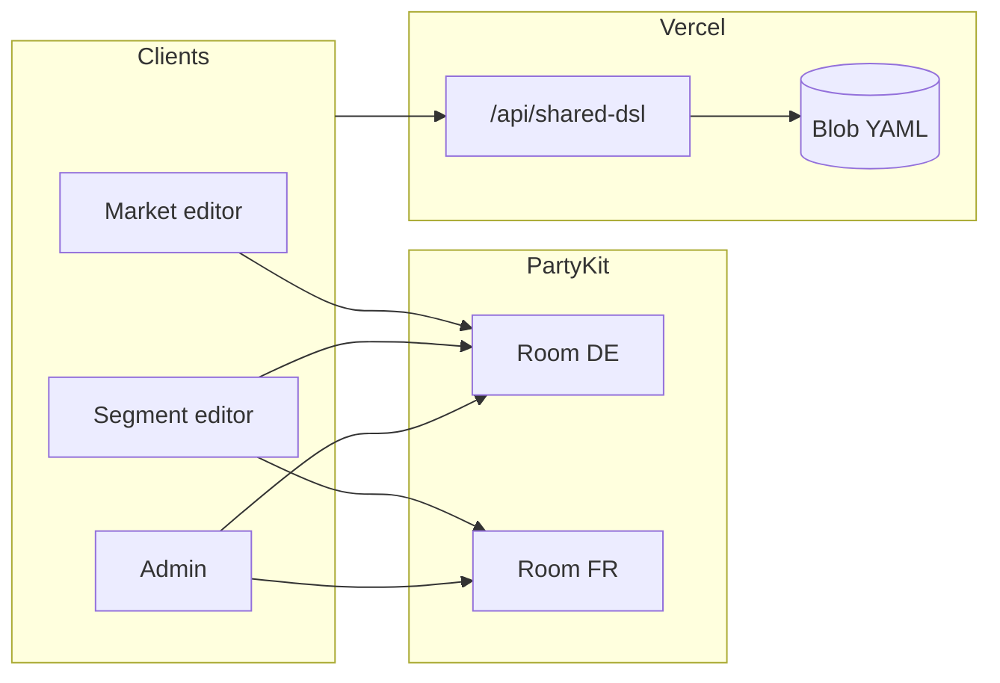

# Design: Real-time collaborative DSL editing (PartyKit + Yjs)

**Epic:** `epic-partykit-yjs` (Phase 4 — Collab core)  
**Date:** 2026-04-06  
**Status:** Draft for implementation planning  

## 1. Problem and goals

### 1.1 Problem

Today the team workspace is a **multi-document YAML** file in Vercel Blob, loaded and saved over **`/api/shared-dsl`**. Concurrent editing via PUT is **last-write-wins**; two people typing will overwrite or conflict (409 on version mismatch), and there is no live shared buffer.

### 1.2 Goals

- **Two (or a few) concurrent participants** — typical case: a **market-focused** editor and a **segment-focused** editor, occasionally a third (e.g. admin). Scale assumptions: **low fan-out**, but **real merge semantics** and **clear mental model**.
- **Live editing** without silent clobbering: **CRDT-backed** shared buffer for the DSL.
- **Coexistence with Blob**: realtime layer for **draft / session** truth; Blob remains **durable checkpoint** with existing **version / 409** behaviour.
- **Align with existing ACL**: session claims **`cap_admin`**, **`cap_segs`**, **`cap_mkts`**, **`cap_ed`** (see [AUTH_PROVIDER.md](../AUTH_PROVIDER.md)) and server behaviour in [`api/lib/capacityWorkspaceAcl.ts`](../../api/lib/capacityWorkspaceAcl.ts) (GET **filter**, PUT **merge** of allowed market documents).

### 1.3 Non-goals (initial phases)

- Large-audience presence, comments-as-CRDT, or chat (separate epics).
- Replacing Blob with Yjs persistence as the only source of truth (versioning epic remains complementary).
- Perfect **offline-first** editing without reconnect rules (document minimal behaviour only).

---

## 2. Personas and collaboration shape

| Persona | Typical `cap_*` shape | Edits | Sees in runway / Code |
|--------|------------------------|-------|------------------------|
| **Market lead** | e.g. `cap_mkts: DE` (+ `cap_ed`) | One market’s YAML document | That market (and filtered manifest order today) |
| **Segment lead** | e.g. `cap_segs: LIOM` (+ `cap_ed`) | Several markets in the segment | Those markets |
| **Admin / you** | `cap_admin` or org admin role | Any market | Full workspace |

**Collaboration pattern we optimize for:** two people who may edit **different markets** at the same time, or **the same market** at the same time (e.g. both adjusting **DE**). Rare third participant is acceptable overhead.

**Implication:** the system must support **per-market edit sessions** that can still compose into the same **multi-doc** shape the engine and Blob already use (`---` separators, manifest ordering — see `mergeMapToYaml` / `mergePartialWorkspacePut`).

---

## 3. Security and data visibility (critical)

### 3.1 Risk: one shared CRDT for the full file

A single **`Y.Text`** holding the **entire** multi-document YAML would **sync identical state to every connected client**. A **market-scoped** user could then **observe other markets’ documents** over the websocket even when **GET /api/shared-dsl** would have **filtered** them out. That violates the **market ACL** story.

### 3.2 Requirement

**Collab sync must not transmit YAML for markets the user is not allowed to read.**  

PUT merge already prevents **writing** disallowed markets; collab must not **leak** disallowed markets on the wire.

### 3.3 Chosen approach: **one PartyKit room per market document**

- **Room id** (conceptual): `capacity:${workspaceKey}:market:${marketId}`  
  - **`workspaceKey`**: until per-org Blob paths ship, use a configured id (e.g. global `default` or env); **target** is **`organizationId`** from Clerk when tenancy is wired so rooms are tenant-scoped.
- Each room hosts a **`Y.Doc`** with a **single `Y.Text`** (or named field) holding **one market’s document body** — the same string shape as one slice in `splitMultiDocYamlToMap` (not including the `---` separator).
- A **market-scoped** user connects **only** to rooms for `marketId ∈ allowedMarketIds`.
- A **segment-scoped** user connects to **one room per market** in their allowed set (typically a handful).
- An **admin** connects to **all** manifest markets that exist in the workspace (or lazy-connect on first open tab / first navigation) — policy TBD to cap connection count; for “few users, few markets” this is acceptable.

**Result:** segment and market editors can **share the DE room** and see each other’s edits to **DE**; the market editor **never** receives sync traffic for **FR** if they are not allowed to read **FR**.

### 3.4 Server-side join rule

On **WebSocket connect**, the PartyKit (or edge) handler:

1. Verifies **Clerk JWT** (same trust model as [`api/lib/clerkAuthSharedDsl.ts`](../../api/lib/clerkAuthSharedDsl.ts)).
2. Parses **`parseCapacityWorkspaceAccess`** (or equivalent) from claims + org role.
3. Parses **room id** → `marketId`.
4. **Allow** connection iff **`allowedMarketIds.has(marketId)`** (or admin).

Rejected joins close with a clear **unauthorized** code (no doc body).

---

## 4. Architecture overview

- **PartyKit**: durable-ish session sync for **Yjs** (`y-partykit` on the server).
- **Vercel**: unchanged **GET/HEAD/PUT** semantics; optional small **token minting** endpoint later if JWT cannot be validated inside PartyKit directly (prefer **shared verification** story — see §8).

---

## 5. Client data flow

### 5.1 Bootstrap

1. User completes normal **GET /api/shared-dsl** (filtered) → populate **`dslText` / `dslByMarket`** as today.
2. **Collab enabled** (feature flag + `VITE_PARTYKIT_HOST` + auth): for each **`marketId`** the user may edit (or view, if viewers join rooms — §7), **open** PartyKit connection + **`Y.Doc`** / provider for that market.
3. **Initial content:** for each room, if server Y state is empty, **seed** `Y.Text` from the parsed document for that market from step 1 (same as `getCodeTabDocumentText` / `splitMultiDocYamlToMap` semantics). If server already has state, **client applies sync** and local Zustand must **follow** (see §5.4).

### 5.2 What a session looks like (product)

- **Solo:** The Code editor looks the same as without PartyKit; you are still on Yjs, just alone. A **Live** badge (and tooltip) in the Code toolbar shows PartyKit connection state when `VITE_COLLAB_ENABLED` + `VITE_PARTYKIT_HOST` are set and you have an editor session for that market.
- **Two editors:** Open the **same org**, **same market tab** (same `marketId` room), both signed in with **edit** rights. Type in one browser; the other should update within a second or so. There is **no** separate “collab window” — it is still one Monaco buffer, now CRDT-backed.
- **If the badge stays Offline / Connecting:** Check PartyKit deploy, `CLERK_SECRET_KEY` on PartyKit, browser devtools **Network → WS**, and that production uses **`wss`** (local dev uses **`ws`**).

### 5.3 Monaco binding

- **Market tabs** (`MainDslWorkspace` + `DslEditorCore`): active tab for market **M** binds Monaco to **`Y.Text` for room M** via **`y-monaco`** (or equivalent maintained binding).
- **Single-doc layout** (one country, no tabs): same idea — one room for that market’s id.
- **Read-only** when `dslMutationLocked` / assistant lock — disable edits but optional **view sync** (§7).

### 5.4 Zustand as derived state

Epic calls for a **single writer** from the collab buffer into app state:

- For each market **M**, subscribe to **`Y.Text`** updates (debounced, e.g. 100–300 ms):  
  **`setState`** → update **`dslByMarket[M]`** and recompute **`dslText`** via existing **`mergeMarketsToMultiDocYaml`** / manifest order (same paths as [`codeViewMarketTabs.ts`](../../src/lib/codeViewMarketTabs.ts)).
- **Avoid** dual sources: while collab is active for market **M**, **do not** also write **M** from raw Monaco `onChange` into Zustand without going through Yjs — the binding should be **Yjs ↔ Monaco** and **Yjs → Zustand**.

### 5.5 Staleness for non-synced markets

A market-scoped user only has rooms for their markets. Other markets’ slices in their local store come from **last GET** and **do not** receive realtime updates — consistent with **no read access**. Runway already **filters** manifest/order by access.

---

## 6. Persistence and conflicts (Blob)

### 6.1 Roles

| Layer | Responsibility |
|-------|----------------|
| **Yjs + PartyKit** | Live convergence for allowed market docs |
| **PUT /api/shared-dsl** | Checkpoint; server **merges** partial YAML per ACL |
| **409 + version** | Surfaces concurrent **save** conflicts |

### 6.2 Save strategy (recommended)

- **Manual “Save to cloud”** and/or **debounced autosave** remain as today, but **payload** is built from **current Zustand / merged multi-doc** (which already reflects Yjs).
- **Scoped PUT** continues to **merge** only allowed documents into the Blob (unchanged server contract).
- If two users **save** conflicting Blob versions, existing **409** UX applies; after resolution, **re-seed or re-sync** Yjs from the new GET if product decision is “Blob wins on explicit pull” (document in runbook).

### 6.3 PartyKit persistence (optional)

PartyKit **can** persist Yjs state for faster reconnect. **Treat as cache**, not legal source of truth: **Blob + version** remain authoritative for compliance and backup. If enabling persistence, define **TTL** or **invalidate on successful PUT** policy in a later iteration.

---

## 7. Viewers vs editors

**Product default (recommended):**

- **Editors** (`cap_ed` or admin): join rooms for allowed markets, **read/write** `Y.Text`.
- **Viewers** (no edit): **do not join** collab rooms by default; they consume **GET** snapshot only — simplest and ACL-obvious.

**Optional enhancement:** viewers join **read-only** (Monaco `readOnly: true`, no local Y insertions). Still requires **same per-market room ACL** so they only stream markets they’re allowed to read. Defer until after editor path is stable.

---

## 8. Authentication and configuration

### 8.1 Env (illustrative)

| Variable | Where | Purpose |
|----------|--------|---------|
| `VITE_PARTYKIT_HOST` | Vite | WebSocket host for PartyKit deployment |
| `VITE_COLLAB_ENABLED` | Vite | Master switch for collab UI + providers |
| Clerk secrets | PartyKit worker / env | Verify JWT on connection (mirror server verification rules) |

### 8.2 JWT verification on PartyKit

Prefer **validating the same Clerk session token** the app already sends to `/api/shared-dsl`. If PartyKit’s runtime makes direct `verifyToken` awkward, options (in order):

1. **Verify in PartyKit** with `@clerk/backend` (or JWKS) — best, one token type.
2. **Short-lived collab ticket** minted by a Vercel route that verifies Clerk and returns a signed cookie/token scoped to `workspaceKey` + `marketId` — extra moving parts, use only if needed.

Document the chosen path in the implementation handoff.

---

## 9. Presence and awareness (phase 2)

For **two** users, lightweight **awareness** (name, colour, cursor/selection in Monaco) materially reduces confusion. Use **Yjs Awareness** (e.g. `y-protocols/awareness`) tied to the **same room** as the market doc.

- **Phase 1:** sync **document** only; optional “N connected” badge per room.
- **Phase 2:** cursors **per market tab** (only show remote carets for peers in **that** room).

---

## 10. Edge cases

| Scenario | Handling |
|----------|----------|
| User switches org | Disconnect all providers; re-bootstrap GET + rooms for new org. |
| Tab switch (segment user) | Swap Monaco binding to another room’s `Y.Text`; ensure layout/resize. |
| Assistant applies bulk edit | Pause or disconnect `y-monaco` for affected market while lock active; resume after merge (same spirit as `dslAssistantEditorLock`). |
| PUT 409 | Banner + user action; on “pull”, merge server YAML into store and **reconcile** Yjs (e.g. replace `Y.Text` from server slice for affected markets) — exact algorithm in implementation plan. |
| Offline / reconnect | Yjs standard resync; if Blob pulled while offline, **reconcile** on reconnect. |

---

## 11. Testing and acceptance criteria

1. **Two browsers**, same org: **market A** and **segment** (includes A) both edit **A**; changes converge without PUT between keystrokes.
2. **Market-scoped** user **cannot** connect to room for disallowed **B** (join rejected).
3. **Scoped PUT**: only allowed markets update Blob; other markets unchanged on server.
4. **409** path still works when two saves race; user can recover without data loss **given** explicit pull/merge UX.
5. **Feature flag off**: zero PartyKit traffic; app behaves as today.

---

## 12. Implementation phases (suggested)

| Phase | Scope |
|-------|--------|
| **P0** | PartyKit project + `y-partykit`; JWT gate; **one pilot market room** behind flag (dev only). |
| **P1** | Per-market rooms + multi-provider client; Monaco tab binding; Yjs → Zustand debounce; GET bootstrap seed. |
| **P2** | Autosave interaction with Yjs; 409 reconcile; optional PartyKit persistence. |
| **P3** | Awareness cursors; viewer read-only join. |

---

## 13. Related docs and code

- [BACKLOG_EPICS.md](../BACKLOG_EPICS.md) — `epic-partykit-yjs`, `epic-market-acl`, `epic-shared-dsl-hardening`
- [AUTH_PROVIDER.md](../AUTH_PROVIDER.md) — `cap_*` claims
- [`api/lib/capacityWorkspaceAcl.ts`](../../api/lib/capacityWorkspaceAcl.ts) — filter + partial merge
- [`src/lib/codeViewMarketTabs.ts`](../../src/lib/codeViewMarketTabs.ts) — tab ↔ multi-doc merge
- [`src/components/DslEditorCore.tsx`](../../src/components/DslEditorCore.tsx) — Monaco

---

## 14. Open decisions (to close during planning)

1. **`workspaceKey`** until per-org Blob: env slug vs Clerk `orgId` when only one prod workspace exists.
2. **Admin connection strategy:** eager connect all markets vs lazy connect on tab open (trade latency vs connections).
3. **409 reconcile:** always “Blob wins on pull” vs “offer merge UI” for in-memory Yjs.

---

*Self-review: addresses ACL leakage, market vs segment personas, Blob coexistence, and phased delivery; no contradiction with existing GET filter / PUT merge model.*
